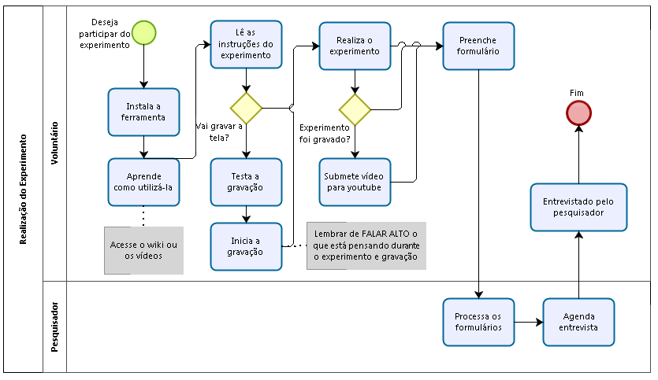

# Testes automatizados da ferramenta {#apendice:testes}

Segue evidências dos testes automatizados da ferramenta.

\includepdf[pages={-}]{docs/rspec.pdf}

# Formulário de configuração PDF {#apendice:formulariopdf} 

O limarka utiliza um arquivo PDF, contendo um formulário para
configurar diversos aspectos da geração do trabalho acadêmico.

A seguir é apresentado esse arquivo configurado para geração deste
trabalho.

\includepdf[pages={-}]{configuracao.pdf}

# Questionário ou entrevista

Exemplo de gravando on-the-fly.

Quando reportando as entrevistas é necessário o tipo de entrevista, quanto tempo elas duraram, o tipo de entrevista e como os participantes foram selecionados \cite[p. 15]{guide2008}

# Entrevista não estruturada

- Ao realizar essa atividade o que consumiu mais temporária
- Em que você consumiu mais tempo realizando a tarefa e por que?

- Quais as razões poderiam lhe motivar a não utilizar o limarka?

# Convite e instruções para execução do experimento

O limarka é fruto de uma [pesquisa de mestrado](https://github.com/edusantana/dissertacao-limarka), e estamos convidado-o a contribuir com ela: *você gostaria de contribuir com a pesquisa realizando este experimento*?

A pesquisa utiliza dois instrumentos para coletar as impressões dos usuários sobre a ferramenta: *Entrevista* e *Vídeo*. Esses dois instrumentos foram escolhidos por não sobrecarregar os voluntários.

O fluxo de atividades para realização do experimento é apresentado a seguir:

{width=100%}

**OBS**: Se você já escreveu sua proposta de trabalho, você pode transcrevê-la para experimentar o limarka.

A proposta elaborada **DEVE** conter:

- Capa, Folha de rosto e Resumo (o *abstract* não é necessário);
- Possuir uma estrutura mínima que caracterize-a como uma proposta de trabalho de conclusão de curso;
- No mínimo mínimo três palavras em inglês no texto;
- No mínimo uma citação de Artigo;
- No mínimo uma citação de Livro;
- No mínimo uma citação de Site;
- No mínimo uma citação indireta;
- No mínimo uma citação com três ou menos linhas;
- No mínimo uma citação direta com mais de três linhas;
- No mínimo uma figura;
- No mínimo uma tabela significativa;
- Um cronograma;
- Seção de Referências.

A proposta elaborada **PODE** conter:

- Citação de citação;
- Apêndices
- Anexos 
- Quaisquer outros recursos.

Todos os elementos presentes no trabalho devem estarem em conformidade com as Normas da ABNT. Esse experimento **é pouco estruturado intencionalmente**, deixando o usuário com liberdade para realizá-lo como preferir.

## Passos para realização do experimento

1. Inicie a gravação
2. Realize o experimento (lembre-se de falar o que está pensando durante a gravação)
3. Submeta a gravação para o youtube ou serviço on-line
4. [Preencha o formulário](https://goo.gl/forms/e2SPTDEOFGZT1YwB2)
5. Aguarde contato do pesquisador

## Gravação do experimento

O [recordmydesktop](https://github.com/abntex/limarka/wiki/Instala%C3%A7%C3%A3o#ferramenta-utilizada-no-experimento-para-grava%C3%A7%C3%A3o-da-tela) é um aplicativo para gravar a tela do computador no Linux, para instalá-lo execute as seguintes instruções no terminal:

    $ sudo apt-get install recordmydesktop

Para iniciar a gravação do vídeo execute (substituindo `NOME` pelo seu nome e `SIGLA` pela sigla da sua instituição):

    $ recordmydesktop --on-the-fly-encoding --fps=30 \
    -o "limarka-experimento1-NOME-SIGLA.ogv"

Teste a gravação do vídeo e do áudio. Para interromper a gravação pressione `CTRL+C` no terminal com a execução do `recordmydesktop`.

**Recomendações**: Caso utilize duas telas, desabilite uma delas durante a gravação. Caso a resolução da sua tela seja **1366x786** altere-a para **1360x786** antes da gravação para evitar problemas.

Quando enviar o vídeo para o Youtube, certifique-se de que [sua conta está habilitada para enviar vídeos maiores do que 15 minutos](https://support.google.com/youtube/answer/71673?hl=pt-BR).

**Lembrete**: Lembre-se de FALAR alto o que está pensando durante a realização do experimento.

## Aguardando contato do pesquisador

Depois de preencher o formulário agendarei uma entrevista com você por Telefone, WhatsApp, Hangout ou Telegram. *Não haverá entrevistas presenciais*.

Obrigado por sua contribuição!
