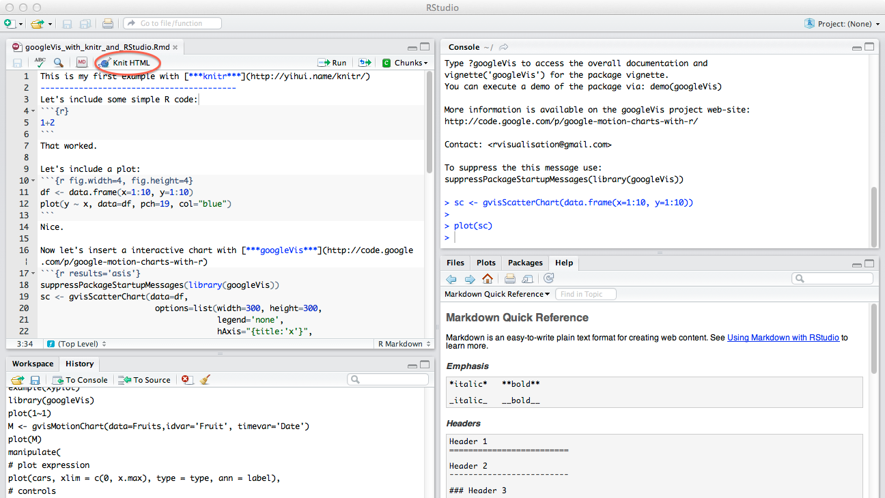

% Utilização de Markdown para elaboração de TCCs: experimento da ferramenta Limarka
% Eduardo de Santana Medeiros Alexandre
% 2017
---
institute: Universidade Federal da Paraíba
# Warsaw #theme: Ilmenau #theme: Darmstadt #theme: Antibes #theme: Darmstadt
theme: Warsaw
lang: pt-BR
graphics: true
slide-level: 2
titlepage-note: Título menor aqui.
header-includes:
  - "\\usepackage{amsfonts}"
  - "\\logo{imagens/limarka-logo.png}"
---

# Introdução

## Contextualização

### Propósito do TCC

- Escrita de Trabalho de Conclusão de Curso (TCC) como requisito para conclusão de curso;

## Alternativas para escrita de TCCs

### Microsoft/Libre Office

- Soluções onerosas de formatações extraídos de TCCs reais

{width=50%}

- Erros são mais perceptíveis durante o processo de orientação.

### Microsoft/Libre Office

{width=40%}

{width=40%}

### Latex

- Permite seus usuários se concentrarem na elaboração do conteúdo do texto.

### Custo do Latex: Legibilidade

A coexistência de códigos Latex no arquivo fonte do texto diminui a legibilidade do texto.

### Legibilidade: Latex vs Markdown
g
{width=70%}

{width=70%}

### Latex para quem não sabe inglês


## Contexto Nacional

<!-- \framesubtitle{Subtitles are not so important.} -->

### Normas
- Normas da ABNT
- Normas da Instituição
- Orientador
- Histórico do que foi aceito no curso

#### Extra

- Guias de formatação

\pause

#### Desafio

- Contemplar peculiaridades exigidas pelas Normas da ABNT e gerenciar os conflitos.


## Motivação e Objetivos

### Motivação


#### Ofertar uma solução alternativa para:

Estudantes nacionais elaborarem seus TCCs utilizando uma linguagem de marcação leve, despreocupando-se das Normas da ABNT e demais exigências de formatação.


### Objetivos

#### Objetivo Geral

*Avaliar* o uso de uma linguagem de marcação leve para escrita de TCCs em conformidade com as Normas da ABNT.

#### Objetivos Específicos

- *Analisar* requisitos de formatação de TCCs;

- *Identificar* linguagem de marcação apropriada para escrita de TCCs

- *Implementar* aplicação que possibilite usuários escrever TCCs nacionais utilizando uma linguagem de marcação leve
  
- *Avaliar* o uso de uma linguagem de marcação leve para a escrita de TCCs nacionais por estudantes

## Metodologia e Publicações
### Metodologia

- Experimento de utilização da ferramenta
    - Observações
    - Entrevistas semiestruturadas
- Análise qualitativa

#### Público do experimento

- Somente voluntários que potencialmente precisariam elaborar um TCC.

### Publicações

- ALEXANDRE, E. de S. M. Limarka: making possible brazilian students writing dissertation and thesis with markdown. *The Journal of Open Source Software*, v. 2, n. 9, 2017. Disponível em: <http://dx.doi.org/10.21105/joss.00169>.

- ALEXANDRE, E. de S. M. One language to rule all writings: why you should be using Markdown. *Journal of Universal Computer Science*. Qualis B1 - *Submetido*.

# Fundamentação Teórica

## Normas da ABNT

### Normas da ABNT

- ABNT NBR 14724, Informação e documentação - Trabalhos acadêmicos - Apresentação;
- ABNT NBR 6023, Informação e documentação - Referências - Elaboração;
- ABNT NBR 6024, Informação e documentação - Numeração progressiva das seções de um documento escrito - Apresentação;
- ABNT NBR 6027, Informação e documentação - Sumário - Apresentação;
- ABNT NBR 6028, Informação e documentação - Resumo - Procedimento;
- ABNT NBR 6034, Informação e documentação - Índice - Apresentação;

### Normas da ABNT (continuação)

- ABNT NBR 10520, Informação e documentação - Citações em documentos - Apresentação;
- ABNT NBR 12225, Informação e documentação - Lombada - Apresentação;
- Código de Catalogação Anglo-Americano. 2. ed. rev. 2002. São Paulo: FEBRA, 2004.
- IBGE. Normas de apresentação tabular. 3. ed. Rio de Janeiro, 1993.

#### Vigência

Cada documento possui uma data de início de vigência, tornando o anterior obsoleto.

### A Capa

a) nome da instituição (opcional);
b) nome do autor;
c) título;
d) subtítulo;
e) número do volume;
f) local (cidade);
g) ano de depósito.\pause

#### Solicitações não provenientes da ABNT

- Logotipo
- Curso
- Departamento

### Regras da ABNT para ilustrações e tabelas {#regras-abnt}

<!-- Eu adicionaria uma foto demonstrando a figura com fonte, título e legenda http://tex.stackexchange.com/questions/78464/background-image-in-beamer-slides -->

- Obrigatoriamente adicionar na **parte superior** (a) o tipo da ilustração (Figura, Quadro, Tabela etc.), (b) um travessão como separador, e (c) um título para a ilustração;

- Obrigatoriamente adicionar na **parte inferior**, a Fonte da imagem, mesmo que seja do próprio autor;

- **Opcionalmente** notas explicativas e legendas também podem ser adicionadas na **parte inferior**;

- Obrigatoriamente **referenciar** a ilustração no texto, o mais próximo possível.\pause

- Guias ou manuais conflitantes com as Normas da ABNT

### Desafio para implementação com linguagens de marcação

#### Suporte para:

- Fonte de ilustrações e tabelas;
- Notas explicativas;
- Diferenciação entre Tabela e Quadro;
- Pré-textuais (Ficha catalográfica).

### Alíneas {#alineas}


#### Exemplo de alínea

    Alínea:
    a) Banana;
    b) Côco;
    c) Manga.

## DocBook

### Descrição do formato DocBook

- formato para produção de livros criado pela editora O’Reilly;
- livros técnicos;
- XML;
- mais de 350 *tags* (v5.0).

### Exemplo de texto no formato DocBook


## Asciidoc

### Propósito original do Asciidoc

- Agilizar a escrita de livros;
- Exportação para o formato DocBook.

#### Características do formato Asciidoc

- Inclusão e formatação de códigos;
- Suporta referência de quase todos os elementos de um livro;
- Ótimo suporte para tabelas;
- Sintaxe de comandos em inglês;
- *Modularização* do texto;
- Extensível através de filtros.

### Visual


### Exemplo


## Markdown ##

### Formato do Markdown

#### Propósito original

- Conversão de texto para HTML.

#### Filosofia

- Código fonte deve ser semelhante a apresentação;
- Escrever o texto sem perceber que há marcações nele.

#### Características do formato Markdown

- Bastante simples;
- Não possui palavras chaves.


# Trabalhos Relacionados

## R Markdown: linguagem para reprodutibilidade de pesquisas científicas

### RStudio com R Markdown

{width=20cm}


<!-- ##### Reprodutibilidade de pesquisas científicas -->

## Proposta para utilização de Markua em dissertações no Departamento de Minas da FEUP

### Proposta


### O que é Markua?


\note[1]{Tipos de recursos: audio, code, image, math, poetry, table and video.}

### Recursos extras do Markua

- Criação de quadros laterais que atravessam páginas
- Criação de quadros *tipados* (Discussão, Erro, Informação, Dica e Atenção)
- Quizz (marcados), Exercícios e Respostas

#### Exemplo de Quizz

```
~~~
{quiz, id: quiz1}
? Quantas letras existem na palavra Markua?

a) 5
B) 6
c) 7
{/quiz}
~~~
```

## ABNTFÁCIL: software para formatação de trabalhos acadêmicos

### O Software

- Software nacional (comercial) -- implementa linguagem de marcação própria.
- Utiliza formulários para gerar gerar/editar conteúdos.


### ABNTFÁCIL tags


### Exemplo de formulário no ABNTFÁCIL


- Inspiração para utilização de formulários no Limarka.

# Realização da pesquisa

## Análise de requisitos

### Fonte dos requisitos

- Normas da ABNT
- Normas e modelos de Instituições
- Manuais do abnTeX
- Solicitações de usuários

### Requisitos Funcionais para o sistema

- Configuração da capa;
- Configuração dos pré-textuais obrigatórios: folha de rosto, folha de aprovação, resumo e *abstract*;
- Criação de Sumário automático;
- Configuração de estilos diferentes para entradas do sumário para os títulos dos textuais e pré-textuais;
- Configuração de estilos de capítulos, seções e texto;
- Inclusão de Ilustrações, **Quadros** e Tabelas com título, fonte e possibilidade de referenciação no texto;
- Elaboração da seção de Referências (com formatação diferenciada);
- Elaboração de apêndices, anexos e **incluir pdfs**;
- Escrita dos principais elementos do trabalho através de uma linguagem de marcação leve.

### Requisitos Não Funcionais

- Fácil utilização. 
- Confiável em relação as mudanças das Normas.


### Realização da pesquisa

| Objetivos da Pesquisa                                            | Concluído |
|------------------------------------------------------------------|:---------:|
| Analisar requisitos de formatação de TCCs| \checkmark |
| Identificar linguagem de marcação apropriada para escrita de TCCs|  | 
| Implementar aplicação que possibilite usuários escrever TCCs nacionais utilizando uma linguagem de marcação leve |  |
| Avaliar o uso de uma linguagem de marcação leve para a escrita de TCCs nacionais por estudantes |  |


## Identificar linguagem de marcação apropriada para escrita de TCCs 


### Asciidoc (original)

- Primeira alternativa devido a experiência prévia na produção de livros do curso de **Licenciatura em Computação a Distância da UFPB**.

#### Livros produzidos

Análise e projeto de sistemas,
Cálculo Diferencial e Integral,
Estruturas de Dados,
Fundamentos Antropo-Filosóficos da Educação,
Fundamentos Psicológicos da Educação,
Fundamentos sócio-histórico da educação,
Introdução a Arquitetura de Computadores, 
Introdução a Compiladores,
Introdução a Computação,
Introdução a Educação a Distância,
Introdução a programação,
Linguagem de Programação I,
Linguagem de programacao II,
Matemática Computacional,
Metodologia do Trabalho Científico,
Objetos Digitais e Educação em Computação,
Probabilidade e Estatística.

### Visual de Livro escrito em Asciidoc


### Transformação XSL para customizar formatação de PDF gerado a partir de Asciidoc (original)

{width=60%}

### Avaliação

*Não é possível* utilizar o formato DocBook como intermediário para produção de TCCs, pois não há correspondentes para: Errata, Folha de Aprovação e Ficha Catalográfica.

#### Tags de Book


### Solução abortada


| Solução                            |  Status |
|:-----------------------------------|:--------:|
| Asciidoc (original)                | Abortada |


### Customização de DocBook com XSL Formatting Objects (XSL-FO)

\framesubtitle{Solução não descrita na dissertação}

- Possibilitaria geração de PDF sem Latex (desejável).
- Geração de DocBook e formatação de PDF através de XSL Formatting Objects (<https://www.w3.org/TR/xsl11/>)


### Exemplos de customizações de classes de parágrafos


### Solução abortada

- Seria necessário implementar todas as regras da ABNT através de FO;
- Incertezas devido a nunca ter sido utilizado antes com este propósito.

| Solução                            |  Status |
|:-----------------------------------|:--------:|
| Asciidoc (original)                | Abortada |
| Asciidoc (DocBook com XSL-FO)      | Abortada |

### Avaliação de Asciidoc (asciidoctor-pdf)

<!--
- Asciidoc (asciidoctor-latex)
- Markdown (original)
- Markdown (Pandoc com template padrão)
- Markdown (template abnTeX2, formulário e processamento)
-->

- Não utiliza DocBook como intermediário (desejado)
- A geração do PDF ocorre sem utilizar Latex
- As configurações de formatação são realizadas através de [arquivo YAML](https://github.com/asciidoctor/asciidoctor-pdf/blob/master/data/themes/default-theme.yml)
- A ferramenta ainda encontra-se em estágio *alpha*

### Solução abortada

- Seria necessário implementar todas as regras da ABNT através de XSL-FO;
- Incertezas devido a nunca ter sido utilizado antes com este propósito.

| Solução                            |  Status |
|:-----------------------------------|:--------:|
| Asciidoc (original)                | Abortada |
| Asciidoc (DocBook com XSL-FO)      | Abortada |
| Asciidoc (asciidoctor-pdf)         | Abortada |


### Avaliação de Asciidoc (asciidoctor-latex)

<!--
# Customização de DocBook para Latex
-->

- Utilização de abnTeX2 para formatação com as Normas da ABNT;
- Utilização de Engine de Templates para gerar código Latex;
- Configuração de pré-textuais utilizando YAML;

    
 
### Fluxo da infraestrutura elaborada


### Benefícios dessa infraestrutura

- Fácil experimentação;
- Transparência nas orientações e escritas de TCCs para educação a distância;

### Problemas da solução

- Requer conhecimentos da sintaxe de YAML e Latex;
- Exige validação do arquivo fonte com base na sintaxe de Asciidoc;
- Exige familiaridade para escrita de termos básico em inglês;
- Inexiste na sintaxe da linguagem para inserir fontes em figuras e tabelas;
- **Submissão de imagens requer saber utilizar o git**;
- `asciidoctor-latex` em estágio *alfa*;

### Solução abortada

| Solução                            |  Status |
|:-----------------------------------|:--------:|
| Asciidoc (original)                | Abortada |
| Asciidoc (DocBook com XSL-FO)      | Abortada |
| Asciidoc (asciidoctor-pdf)         | Abortada |
| **Asciidoc (asciidoctor-latex)**       | **Abortada**|

### Avaliação de Markdown (Pandoc)

#### Pandoc - Conversor universal

**Formatos suportados**: native Haskell,  JSON version of native AST, plain text, pandoc’s extended Markdown, original unextended Markdown,  PHP Markdown Extra, GitHub-Flavored Markdown, MultiMarkdown,  CommonMark Markdown,  reStructuredText,  XHTML,  HTML5,  LaTeX, LaTeX beamer slide show,  ConTeXt,  groff man,  MediaWiki markup, DokuWiki markup,  ZimWiki markup,  Textile, Emacs Org mode,  GNU Texinfo,  OPML,  DocBook 4,  DocBook 5,  OpenDocument,  OpenOffice text document,  Word docx,  Haddock markup,  rich text format,  EPUB v2 book,  EPUB v3,  FictionBook2 e-book,  AsciiDoc, InDesign ICML,  TEI Simple,  Slidy HTML and JavaScript slide show, Slideous HTML and JavaScript slide show,  DZSlides HTML5 + JavaScript slide show, reveal.js HTML5 + JavaScript slide show,  S5 HTML and JavaScript slide show.

### Configuração em YAML


### Template Latex Padrão


### Resumo da avaliação

a. Configuração requer conhecimentos de Estruturas de Dados, sintaxe YAML e Latex 

a. Usuário teria dificuldade em obter suporte do código Latex gerado

a. Os pré-textuais precisariam ser criados em Latex pelo usuário

a. A sintaxe de citação da linguagem suporta um único estilo de chamada de citações

a. Inexiste suporte na sintaxe da linguagem para especificação de fonte de ilustrações e tabelas

# Conclusão

