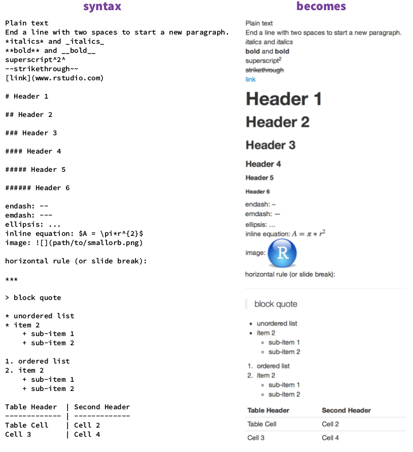
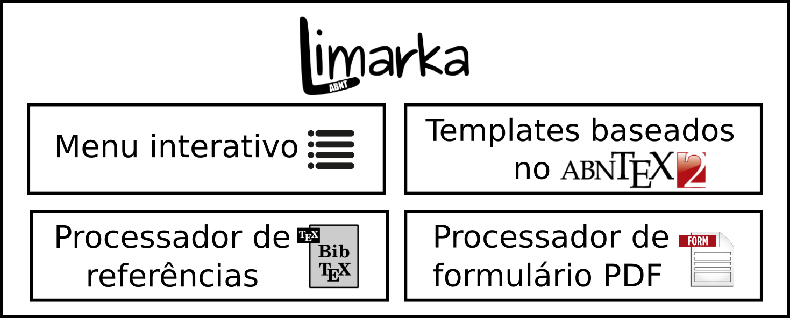
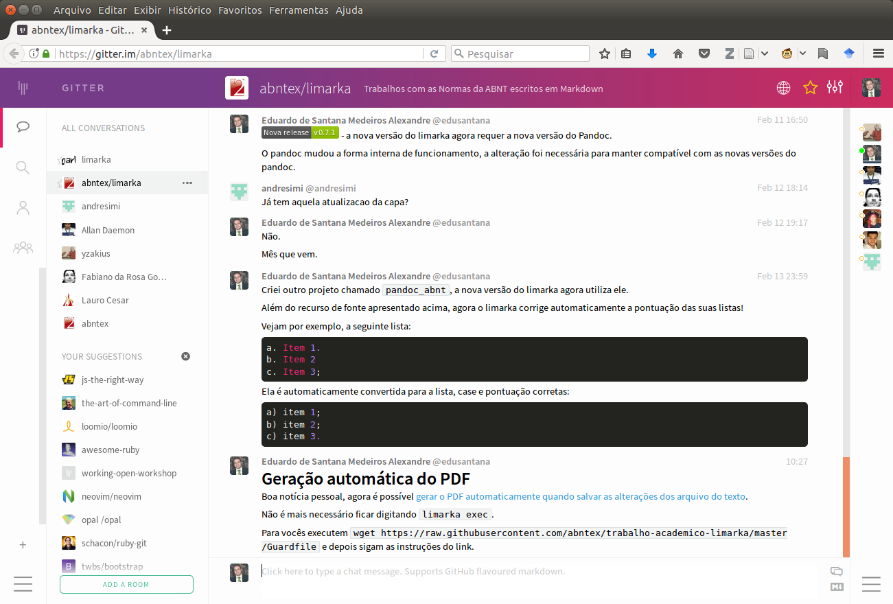
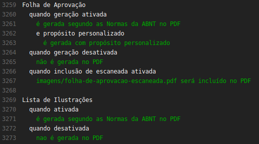
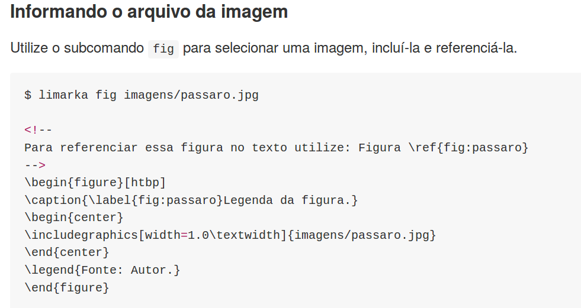
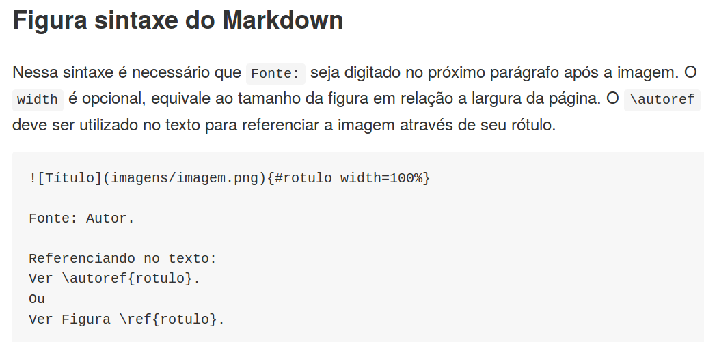
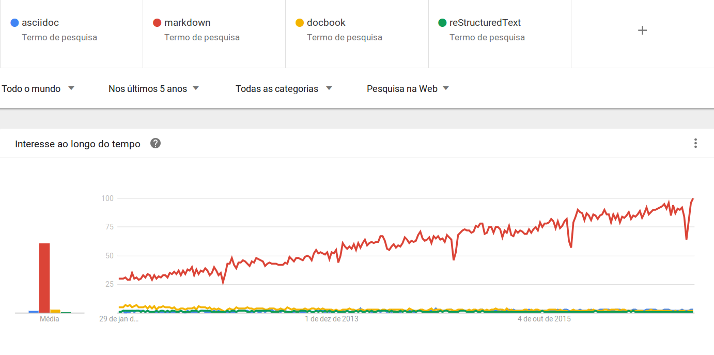

# Introdução

Durante o período de formação superior no Brasil muitos estudantes necessitam escrever um trabalho de conclusão de curso (TCC) como requisito para conclusão dos estudos. Neste momento eles são convocados a realizarem uma pesquisa científica e reportarem o trabalho através de uma monografia, dissertação ou tese -- geralmente em conformidade com as Normas da Associação Brasileira de Normas Técnicas (ABNT).

De modo geral, o público nacional dispõe de duas alternativas para elaboração dos TCCs: utilização de um editor de texto rico (como o Microsoft Word ou Libre Office) ou utilização do Latex. 

A primeira alternativa demanda do usuário conhecimentos de uso avançados do editor para produzir e formatar um documento de acordo com as normas da ABNT, até mesmo quando utiliza-se um modelo previamente disponibilizado. 

A elaboração de um trabalho de conclusão de curso em conformidade com as Normas da ABNT em um editor de texto rico (como o Word) requer conhecimentos técnicos de formatação. A \autoref{fig:problemas:formatacao} apresenta trechos de TCCs reais empregando soluções de formatações onerosas e passíveis de erros. Alguns estudantes sem esses conhecimentos técnicos e desconhecendo as Normas são compelidos a contratarem serviços para adequarem seu trabalho às Normas da ABNT.

\begin{figure}[htbp]
	\caption{Soluções onerosas de formatações extraídos de TCCs reais durante o processo de Orientação\label{fig:problemas:formatacao}}
	\centering
    \subfloat[Tentativa de implementar espaçamento de títulos]{{\includegraphics[width=8cm]{imagens/problema-sem-numeracao-sem-estilo.png} }}%
    \quad
    \subfloat[Tentativa de realizar quebra de página]{{\includegraphics[width=7cm]{imagens/problema-referencias-quebra-de-pagina-com-enters.png} }}%
    \quad
    \subfloat[Sumário elaborado manualmente]{{\includegraphics[width=8cm]{imagens/problema-sumario-nao-automatizado.png} }}%
\legend{Fonte: Autor.}
\end{figure}

Embora o Latex possua uma *curva de aprendizado inicial*, editores *on-line* como o Overleaf \cite{overleaf} ou ShareLatex \cite{sharelatex} oferecem ambientes com interfaces gráficas que possibilitam uma experiência que se assemelham aos editores de texto rico, diminuindo a curva e facilitando a escrita. Esta alternativa em conjunto com a utilização de modelos pré-configurados possibilita seus usuários abstraírem algumas regras de formatação (codificadas nos modelos), por essa razão *o Latex é conhecido por permitir seus usuários se concentrarem na elaboração do conteúdo do texto*, abstraindo a formatação. 

*A utilização de Latex tem um custo: a coexistência de códigos Latex no arquivo fonte do texto, diminuindo a legibilidade do arquivo fonte do texto*. A baixa legibilidade do texto Latex pode ser percebida na \Cref{lista:latex}, com as nomenclaturas dos códigos originadas do inglês, o usuário do Latex deve habituar-se a conviver com esses códigos em seu texto. Como seria uma alternativa sem esse custo?

*O uso de linguagens de marcação leve possibilitaria obter os benefícios do Latex sem o custo de baixa legibilidade do arquivo fonte do texto.* As linguagens de marcação leve (*lightweight markup language*) surgiram em diferentes contextos para elaboração de textos e mensagens de comunicação. Essas linguagens, mais simples que Latex, possibilitam os usuários redigirem utilizando uma sintaxe de fácil memorização, utilização e reconhecimento (ver \Cref{lista:markdown}). Seria possível utilizá-las para contemplar as exigências de produção de TCCs nacionais?

\begin{figure}[htbp]
	\caption{Equivalência entre Latex e uma linguagem de marcação leve\label{fig:latex-vs-markdown}}
	\centering
    \subfloat[Fonte de texto escrito em Latex, repleto de códigos e com baixa legibilidade.]{\label{lista:latex}{\includegraphics[width=12cm]{imagens/lista-latex.png} }}%
	\newline
    \subfloat[Fonte de texto escrito em uma linguagem de marcação, mais limpo e maior legibilidade.]{\label{lista:markdown}{\includegraphics[width=13cm]{imagens/lista-markdown.png} }}%
\legend{Fonte: Autor.}
\end{figure}

*A natureza das normas exigidas no contexto nacional para elaboração de um TCC são complexas e conflitantes*. De forma geral, dever-se-ia exigir dos TCCs apenas contemplar as Normas da ABNT, na prática exige-se que o estudante produza um documento que contemple uma mesclagem entre Normas da ABNT, normas da instituição/curso, orientações do orientador e histórico do que foi aceito previamente pelo curso. *Sem alterar o contexto nacional, a utilização de uma linguagem de marcação leve para elaboração de TCCs tem o desafio de contemplar peculiaridades exigidas pelas Normas da ABNT e gerenciar conflitos entre as exigências de todos esses agentes*.

Este trabalho investiga a utilização de uma linguagem de marcação leve para produção de TCCs em conformidade com as Normas da ABNT para o contexto nacional.

## Motivação

A motivação desse trabalho consiste em ofertar uma solução para os estudantes nacionais elaborarem seus TCCs, beneficiando-se da utilização de uma linguagem de marcação leve para escrita do trabalho, proporcionando-lhes uma experiência alternativa ao Latex, despreocupando-os das Normas da ABNT e demais exigências de formatação.

## Objetivos

Nessa seção são apresentados o objetivo geral e os específicos da pesquisa.

### Objetivo Geral

O objetivo geral desse trabalho é *avaliar* o uso de uma linguagem de marcação leve para escrita de TCCs em conformidade com as Normas da ABNT.

### Objetivos Específicos

- *Analisar* requisitos de formatação de TCCs;

- *Identificar* linguagem de marcação apropriada para escrita de TCCs

- *Implementar* aplicação que possibilite usuários escrever TCCs nacionais utilizando uma linguagem de marcação leve
  
- *Avaliar* o uso de uma linguagem de marcação leve para a escrita de TCCs nacionais por estudantes

## Metodologia ##

Esta pesquisa adotou o método *qualitativo*. De acordo com \cite{hazzan2006qualitative} o método qualitativo deve ser empregado quando o estudo é um dos pioneiros na área e não existem dados suficientes que sugestionem elaborações de hipóteses *a priori*. Portanto a escolha do método qualitativo nessa pesquisa é justificada devido a ausência de pesquisas sobre utilização da linguagem Markdown para produção de TCCs nacionais.

Para avaliação do uso da linguagem foram realizados experimentos, utilizando-se a observação e entrevista semiestruturada como os instrumentos de coleta de dados (Seção \ref{avaliacao}). 

<!-- Pq esse instrumento foi escolhido?--> 

<!-- Experimento não realístico, Observação, Entrevista.
Estudo de Caso? Utilização, Entrevista.

A avaliação da utilização do sistema foi realizada através de experimentos com usuários e a entrevista semiestruturada foi 

Ver: Chapter 4 Ann Blandford and Thomas Green Methodological Development -->

<!-- Essa pesquisa utiliza filosofia Pragmática \cite[easterbrook2008selecting], ao escolher o método de pesquisa que melhor convém ao pesquisador para solucionar o problema em que se depara. -->

Os perfis dos voluntários da pesquisa foram escolhidos tentando maximizar sua motivação para utilização da ferramenta. Por isso *a pesquisa foi realizada apenas com estudantes de graduação ou pós-graduação que potencialmente precisariam escrever um TCC* para concluir seus estudos e já tiveram contato com as normas da ABNT durante sua formação. Estudantes que desconhecem a problemática da elaboração de um TCC ou indivíduos que não precisarão elaborá-lo, seja por terem concluído ou abandonado os estudos, não participaram da pesquisa.

<!--
Fazer perguntas sobre motivação, percepção e experiência.\cite[p. 36]{guide2008}

Ver: \cite{Seaman2008QualitativeMethods}
-->

<!-- The  principal  advantage  of  using  qualitative  methods  is  that  they  force  the 
researcher to delve into the complexity of the problem rather than abstract it away. 
Thus the results are richer and more informative. They help to answer questions 
that involve variables that are difficult to quantify (particularly human characteristics such as motivation, perception, and experience).

-->

## Publicações Relacionadas

O artigo \cite{limarka_paper} publicado no *Journal of Open Source Software* é um reconhecimento público que o [software desenvolvido nesta pesquisa](https://github.com/abntex/limarka#readme), foi elaborando contemplando todos os requisitos do *journal* \cite{joss} que abrange:

a. Licença do software
b. Documentação
c. *statement of need*;
d. Instruções de instalação
e. Exemplo de uso
f. Documentação da API
g. Testes
h. Guias para contribuição
i. Funcionalidade

<!-- 
- pbcib
-->

## Estrutura da Dissertação ##

Esta dissertação está dividida em seis capítulos, sendo o primeiro a introdução e os demais:

- Capítulo 2: Apresenta a fundamentação teórica, abordando assuntos necessários para o desenvolvimento do trabalho;
- Capítulo 3: Apresenta os trabalhos relacionado sobre criação de
  linguagens de marcação simples para o contexto acadêmico;
- Capítulo 4: Apresenta o cerne da pesquisa, descrevendo como os objetivos da pesquisa foram alcançados.
- Capítulo 5: Apresenta a conclusão;
- Capítulo 6: Apresenta as considerações finais.

# Fundamentação Teórica
	
A fundamentação teórica do trabalho apresenta as Normas da ABNT, e alguns dos seus requisitos.

Em seguida apresentamos o projeto abnTeX que implementa os requisitos das Normas da ABNT e auxiliou a popularizar o uso do Latex na comunidade acadêmica nacional.

Em seguida são apresentadas duas linguagens de marcação de texto Markdown e Asciidoc. A primeira, mais limitada, surgiu para edição de mensagens para Internet, enquanto a outra surgiu com o propósito de elaboração de livros técnicos. Ambas as linguagens não apresentam sintaxe que possibilitam a implementação dos requisitos das Normas da ABNT.

O formato de arquivo de configuração YAML é apresentado como uma alternativa que exige conhecimentos técnicos para sua utilização.

Os formulários em PDFs são apresentados como alternativas para aquisição de dados do usuário.

## Normas da ABNT para trabalhos acadêmicos {#abnt}

*As Normas da ABNT apresentam um papel fundamental nessa pesquisa: fornece requisitos de formatação e apresentação dos TCCs*. Qualquer sistema que se proponha a permitir a escrita de TCCs nacionais deve contemplar as essas Normas.

As normas da ABNT que regulam os elementos dos TCCs estão divididas nos seguintes documentos:

- ABNT NBR 14724, Informação e documentação - Trabalhos acadêmicos - Apresentação;

- ABNT NBR 6023, Informação e documentação - Referências - Elaboração;

- ABNT NBR 6024, Informação e documentação - Numeração progressiva das seções de um documento escrito - Apresentação;

- ABNT NBR 6027, Informação e documentação - Sumário - Apresentação;

- ABNT NBR 6028, Informação e documentação - Resumo - Procedimento;

- ABNT NBR 6034, Informação e documentação - Índice - Apresentação;

- ABNT NBR 10520, Informação e documentação - Citações em documentos - Apresentação;

- ABNT NBR 12225, Informação e documentação - Lombada - Apresentação;

- Código de Catalogação Anglo-Americano. 2. ed. rev. 2002. São Paulo: FEBRA, 2004.

- IBGE. Normas de apresentação tabular. 3. ed. Rio de Janeiro, 1993.

Cada documento possui uma data de início de vigência, e posteriormente uma nova versão do documento pode surgir, tornando a versão anterior obsoleta.

*Fazendo-se analogia a Orientação a Objetos, as Normas da ABNT equivaleria a uma classe Abstrata*. Ela contém diversas informações mas deixa deliberadamente diversos pontos em aberto tais como: quais fontes e tamanhos utilizar, configuração dos cabeçalhos de página, formatação do sumário e títulos das seções etc. Os guias de formatação surgiram para auxiliar os alunos a implementarem as normas em seus trabalhos, apresentando informações específicas decididas pelos autores dos guias.

*Um sistema que se proponha a produzir trabalhos em conformidade com as Normas da ABNT deve ser aberto para customizações*. 

*O que não divergir das Normas é permitido.* Os pontos em aberto das Normas permite que sejam adicionados novos conteúdos. Se o conteúdo adicionado não for divergente do especificado nas Normas, o documento ainda é considerado que está de acordo com as Normas.

A seguir são destacadas regras de três elementos relevantes a essa pesquisa: capa, ilustrações e tabelas.

<!-- Mostrar imagem do fórum como suporte da ferramenta -->

### A Capa

A NBR 14724 \cite[p. 5-6]{ABNT14724} que normatiza a capa do trabalho, especifica que ela deve conter os seguintes elementos:

a) nome da instituição (opcional);
b) nome do autor;
c) título;
d) subtítulo;
e) número do volume;
f) local (cidade);
g) ano de depósito.

### Regras da ABNT para ilustrações e tabelas {#regras-abnt}

As regras para ilustrações e tabelas são relevantes para essa pesquisa pois *a sintaxe da linguagem de marcação leve escolhida para escrita dos TCCs não possibilita que a Norma seja contemplada para esses elementos*.

Segundo a ABNT NBR 14724:2011 \cite[p. 11]{ABNT14724}, ao inserir uma ilustração no texto, deveremos:

- Obrigatoriamente adicionar na *parte superior* (a) o tipo da ilustração (Figura, Quadro, Tabela etc.), (b) um travessão como separador, e (c) um título para a ilustração. (Regra de apresentação);

- Obrigatoriamente adicionar na *parte inferior*, a fonte da imagem, mesmo que seja do próprio autor. (Regra de apresentação);

- Opcionalmente notas explicativas e legendas também podem ser adicionadas na *parte inferior*. (Regra de apresentação);

- Obrigatoriamente *referenciar* a ilustração no texto, o mais próximo possível. (Regra de utilização).

As tabelas também possuem regras de apresentações adicionais, que são normatizadas pelo IBGE, através do documento "Normas de apresentação tabular".

Embora estas informações estejam claras nas Normas da ABNT, alguns guias de formatação apresentam instruções contraditórias, como mostrado a seguir.

### Guias ou manuais conflitantes com as Normas da ABNT

*Alguns guias de formatação disponibilizados por instituições de ensino superior estão em conflito com as Normas da ABNT*. Os guias são documentos que apresentam informações adicionais (tais como tamanho ou tipo da fonte de determinados elementos) que direcionam os alunos a uma implementação das Normas, mas que não são exigências delas. 

Segue exemplos de trechos de guias que estão em conflito com as Normas da ABNT:

> o título [da figura] *na parte inferior*, sem ponto final, precedido da palavra FIGURA (ou GRÁFICO) e do número de ordem em algarismos arábicos, deve ser digitado em espaço simples e fonte tamanho 12, sem negrito; 
>
> na parte inferior da Figura deve constar *também* a fonte de onde foram obtidas as informações e a legenda (se houver), deve ser digitado em espaçamento simples e fonte tamanho 10, minúscula e sem negrito.  Faz-se necessária a indicação completa da fonte na seção “Referências”. \[...\] \cite[p. 7, grifo nosso]{conselheiro_lafaiete_manual_2016}

> A identificação da figura deve estar localizada em sua *parte inferior*, em letras maiúsculas, em tamanho 10, alinhada à margem lateral esquerda do texto, contendo: 
>
> \[...\] 
> 
> 3\) título, precedido por *um hífen*, sem ponto final. \cite[p. 6, grifo nosso]{joelma_marques_da_silva_normas_2012}

Como pode ser visto esses trechos dos guias contém:

a. instruções adicionais: formatação específicas, como o tamanho da fonte, alinhamento e indicação de termos em maiúsculos
b. restrições adicionais: não utilizar ponto final nos títulos
c. contradição com a Norma: posicionamento do título na parte inferior, em vez da parte superior (ver \autoref{regras-abnt} - \nameref{regras-abnt}).

### Alíneas {#alineas}

Segundo a norma ABNT NBR 6024:2012 as alíneas são as subdivisões das seção do texto. Algumas das regras sobre as alíneas são apresentadas a seguir:

a. o texto que antecede as alíneas terminam em dois pontos
a. as alíneas são iniciadas por letras, seguido do carácter ")";
a. o texto da alínea deve iniciar com letra em minúsculo e terminar com ponto e vírgula, menos a última alínea que deve terminar com ponto.

    

<!-- explicar o que é uma alínea -->

### Discussão

A capa é um dos principais elementos customizados pelas instituições, costuma-se adicionar conteúdos que não estão presentes nas Normas, tais como:

- Logotipo da instituição.
- Curso ou Programa de Pós-Graduação;
- Departamento

Um sistema para produção de TCCs nacionais *dever contemplar customizações da capa e requisitos dos guias*, que podem conter instruções de formatações arbitrárias, quem devem poder se implementadas também. 

*Os estudantes podem estar sendo sobrecarregados com atividades de formatação*. As instituições não são obrigadas a exigirem as Normas da ABNT para trabalhos acadêmicos, podendo especificar regras próprias. Mas quando elaboram guias de formatação contraditórios e sem ofertarem modelos (Word, LibreOffice e Latex) seus estudantes precisarão de um esforço maior para implementar as regras da instituição em seus trabalhos. Eles podem confundir e passar a considerar que as Norma da ABNT e as instruções dos Guias são idênticos. *No caso extremo um estudante precisaria implementar quatro versões diferentes das Normas da ABNT* nos TCCs, quando sua formação acadêmica (graduação, especialização, mestrado e doutorado) ocorrer em instituições diferentes.

<!-- 

## Fluxo de escrita científica ##

http://blog.kdheepak.com/writing-papers-with-markdown.html 

-->

## Linguagens de marcação ##

<!-- Falar sobre Linguagem de marcação sem ser leve -->

As linguagens de marcação mais conhecidas são HTML, devido a utilização nas páginas de Internet, e XML elaborado para troca de dados através da Internet.

O padrão XML foi elaborado baseado em dez princípios \cite{xml}, dentre os quais destacamos:

- Deve ser fácil de utilizar através da internet
- Deve suportar uma grande variedade de aplicações
- Deve ser fácil escrever programas que processem documentos XML
- Documentos XML devem ser *legíveis para os humanos e razoavelmente limpos*;
- Documentos XML devem ser *fáceis de serem criados (por humanos e sistemas)*;
- *Minimizar a digitação (keystrokes) não é considerado importante* em detrimento de alcançar as demais metas.

Os três primeiros princípios estão relacionados a interoperabilidade e a facilidade de processamento de documentos XML. Enquanto os três últimos estão relacionados a fatores humanos: escrita e leitura.

A próxima seção apresenta uma linguagem de marcação baseada em XML, elaborada para permitir a escrita de livros.

### Docbook ###

\index{DocBook}
Nessa seção é apresentado o formato DocBook, uma linguagem de marcação com o propósito original de possibilitar publicação de livros técnicos.

O Docbook é um formato XML de produção de livros criado pela editora O’Reilly, especializada na produção e comercialização de livros técnicos. O formato possui diversas versões que determinam todos os elementos de um livro \cite{docbook-guide}. Foram produzidas várias ferramentas para converter um documento DocBook para apresentação em diversos formatos (HTML, PDF, EPUB, etc).

Na versão 5.0, o formato DocBook possui mais de 350 *tags* para contemplar a escrita dos livros com todos seus elementos: prefácio, preambulo, resumo, dedicatória, capítulo, glossário, sinopse, índice remissivo, exemplos, quadros (notas, informações, atenção), códigos fontes etc. Com o DocBook é possível separar a formatação da apresentação e configurá-la para cada formato de saída desejado.

A complexidade dessas *tags* e o número elevado de digitação necessário para escrita dos textos motivou a criação de uma linguagem mais simples, mas que fosse capaz de aproveitar todas as ferramentas (uma lista de ferramentas pode ser obtida através do link <http://docbook.org/tools/>) compatíveis com formato DocBook: a linguagem Asciidoc (Seção \ref{Asciidoc}).

### Discussão

O princípio da filosofia da concepção do XML *"minimizar a digitação não é considerado importante"* não se aplica bem em atividades em que a principal ação seja a escrita por humanos. As linguagens de marcação leves, apresentadas na próxima seção, tem como principal requisito facilitar a escritas por humanos.

## Linguagens de marcação leve {#LML}

<!-- A lightweight markup language (LML), also termed a simple or humane markup language, is a markup language with simple, unobtrusive syntax. -->

<!--
https://techwhirl.com/series/structured-writing/
https://techwhirl.com/what-is-structured-writing/

-->

O princípio das linguagens de marcação leve (*lightweight markup languages*) é que os textos sejam fáceis de serem digitados e lidos por humanos, elas costumam serem utilizadas para escrita de textos e composição de mensagens na Internet. 

Nessa seção são apresentadas duas linguagens de marcação leves: Asciidoc uma linguagem originada para produção de livros no formato DocBook; e Markdown que teve como objetivo original escrita de mensagens e geração de código HTML.

### Asciidoc {#Asciidoc}

\index{Asciidoc}
Nessa seção é apresentado a linguagem de marcação leve Asciidoc que teve como propósito original agilizar a produção de livros, através da exportação para o formato DocBook.

A linguagem Asciidoc foi concebida para agilizar a produção de livros técnicos no formato DocBook. Em vez de escrever o livro em XML, o autor poderia utilizar a sintaxe do Asciidoc (que requer menos digitação) e exportar os arquivos em conformidade com o padrão DocBook \cite{asciidoc}.

A Asciidoc tem uma sintaxe mais simples para criar os elementos que correspondem as *tags* do DocBook,  aceitando inclusive a inserção de código DocBook puro. Ela suporta modularização do texto em vários arquivos, permite incluir códigos fontes de arquivos externos e a saída da execução de comandos.

Ela é expansível através da criação ou instalações de filtros, existem filtros para geração de QRCode, diagramas UML, partitura etc.

A sintaxe de criação de tabelas permite mesclar células, configurar o alinhamento de colunas (ou de células individualmente), cabeçalho e rodapé, além de possibilita inclusão de dados externos, como um arquivo de texto separado por vírgulas. 

Por ter sua origem na produção de livros, é possível referenciar automaticamente quase todos os elementos, tais como: imagens, tabelas, capítulos, seções, códigos, quadros, etc.

Como diferencial para produção de livros técnicos também permite destaque automático das sintaxes de diversas linguagens de programação e inserção de códigos Latex.

O curso de Licenciatura em Computação a distância da Universidade Federal da Paraíba editorou livros de diferentes áreas do conhecimento utilizando esta linguagem (<https://github.com/ufpb-computacao>).

### Markdown ###

\index{Markdown}
Markdown é uma linguagem de marcação de texto simples que dispensa o uso de palavras chaves \cite{pandoc}. Sua origem foi inspirada na escrita de e-mails e seu propósito original era exclusivamente *escrever para Web* (geração de código HTML). Sua filosofia é que *o formato do texto escrito possua uma formatação visual similar à apresentação do documento final* \cite{markdown}.

A \autoref{fig:rmarkdown} apresenta um subconjunto da linguagem R Markdown (uma extensão de Markdown). Na coluna esquerda (*syntax*) é apresentada a sintaxe da linguagem, na coluna do lado direito (*becomes*) temos a apresentação em HTML que seria gerado a partir do código da esquerda. É possível ver a sintaxe para itálico, negrito, capítulos e seções (*headers*), listas, tabelas etc.

{#fig:rmarkdown width=70%}

Fonte: \cite{markdown-sintaxe}.

Várias ferramentas possuem implementações próprias do Markdown, expandindo o formato original para contemplar novos contextos e funcionalidades, uma bastante utilizada é a Pandoc (Seção \ref{pandoc}). 

### Notações de imagens e tabelas do Markdown não são expressivas para atender requisitos da ABNT {#inclusao-imagens-e-tabelas}

Nessa seção é apresentada a notação de inclusão de imagens e tabelas no Markdown do Pandoc *e como ela são insuficientes para atender as especificações das Normas da ABNT*.

A notação original para inserir imagens (ver \autoref{codigo:figura}) no Markdown é simples, sendo de fácil
memorização e utilização. No entanto, ela não possibilita referenciar as imagens no texto. Uma extensão do formato foi criada para superar essa limitação, um exemplo de sua notação pode ser visto em \autoref{codigo:figura:referenciavel}. Percebe-se que a inclusão do `#id` possibilita identificar essa imagem e criar mecanismo para referenciá-la unicamente.

\begin{lstlisting}[caption={Exemplo da sintaxe de Markdown para inserir uma figura},label=codigo:figura,float]

\end{lstlisting}

\begin{lstlisting}[caption={Exemplo da sintaxe alterada de Markdown para possibilitar referenciar a figura no texto},label=codigo:figura:referenciavel,float]
{#id}
\end{lstlisting}

O Markdown do Pandoc disponibiliza 4 sintaxes diferentes para elaboração de tabelas, o \autoref{tabela:mark} apresenta uma delas. Essa notação não permite configurar alinhamento, e nenhuma das demais notações permite a mesclagem de células.

\begin{lstlisting}[caption={Código Markdown para criação de uma Tabela},label=tabela:mark, float]
: Título da tabela

+---------------+---------------+--------------------+
| Fruta         | Preço         | Descrição          |
+===============+===============+====================+
| Banana        | $1.34         | - pequena          |
|               |               | - cor amarela      |
+---------------+---------------+--------------------+
| Laranja       | $2.10         | - mimo do céu      |
|               |               | - cor laranja      |
+---------------+---------------+--------------------+
\end{lstlisting}

É válido mencionar que a edição de uma tabela, no formato apresentado, através de um editor de texto simples pode ser bastante tediosa. O \autoref{codigo:tabela:editada} apresenta um possível problema de edição, ocorrido na linha 5 ao alterar o texto sobre a cor da banana. Após a alteração percebe-se que tabela não encontra-se alinhada como anteriormente, o usuário precisaria alterar o restante da tabela para mantê-la consistente com essa sintaxe de tabela. O \autoref{codigo:tabela:consistente} apresenta a tabela consistente novamente, *visualmente percebe-se a alteração através do aumento do tamanho da última coluna da tabela*.

<!--, quando o editor não provém suporte a edição de tabelas com essa notação. -->

\begin{lstlisting}[caption={Apresentação de problema causado por edição na tabela anterior}, label=codigo:tabela:editada, float, numbers=right]
+---------------+---------------+--------------------+
| Fruta         | Preço         | Descrição          |
+===============+===============+====================+
| Banana        | $1.34         | - pequena          |
|               |               | - cores amarela ou verde     |
+---------------+---------------+--------------------+
| Laranja       | $2.10         | - mimo do céu      |
|               |               | - cor laranja      |
+---------------+---------------+--------------------+
\end{lstlisting}

\begin{lstlisting}[caption={Tabela alterada para manter a consistência após edição},label=codigo:tabela:consistente, float, numbers=right]
+---------------+---------------+--------------------------+
| Fruta         | Preço         | Descrição                |
+===============+===============+==========================+
| Banana        | $1.34         | - pequena                |
|               |               | - cores amarela ou verde |
+---------------+---------------+--------------------------+
| Laranja       | $2.10         | - mimo do céu            |
|               |               | - cor laranja            |
+---------------+---------------+--------------------------+
\end{lstlisting}

Para que essa sintaxe de tabela seja empregada com facilidade pelo usuário é recomendado que o editor de texto utilizado implemente funcionalidades para auxiliar a edição da tabelas com essa sintaxe, tal como o Emacs que permite alterar o tamanho da coluna e incluir textos sem ocupar os espaços das demais colunas.

Atualmente todas as sintaxes de tabelas em Markdown, aceitas pela ferramenta Pandoc (apresentada mais adiante), não aceitam mesclar células.

<!-- E as tabelas *não possuem sintaxe para mesclagem de células* -->

### Discussão

Duas linguagens de marcação leve foram apresentadas: Asciidoc e Markdown. Elas possibilitam soluções que facilitam a escrita para os usuários, pois minimizam a digitação (em comparação a DocBook).

No entanto, as soluções com estas linguagens teriam as seguintes limitações:

a) Falta de especificação de fonte

    A exigência das Normas da ABNT sobre a *especificação da fonte de figuras e tabelas não pode ser atendidas por nenhuma das duas linguagens*, pois suas sintaxes não possibilitam isso.

b) Impossibilidade de mesclar células com Markdown

    A mesclagem de células só é permitida na sintaxe de Asciidoc, Markdown não oferece suporte para isso.

Para utilização dessas linguagens de marcação leves na escrita de TCCs deve-se criar mecanismos para sanar suas limitações.

## Recursos diversos ##

Nesta seção estão agrupados recursos diversos que são relevantes para essa pesquisa:

a. Pandoc

    Ferramenta que possibilita conversão de código Markdown para Latex.

b. \ YAML

    Formato de arquivo para troca de dados *tipados*.

c. abnTeX2

    Pacote e conjunto de modelos Latex que permite a produção de documentos em conformidades com as Normas da ABNT.

d. Formulários PDF

    Recurso do arquivo PDF que possibilita utilizar um formulário para obtenção de dados do usuário.

### Pandoc {#pandoc}

\index{Pandoc}

A ferramenta Pandoc é uma das principais ferramentas que implementa a leitura de texto em Markdown. 

A arquitetura da ferramenta Pandoc permite converter arquivos em diferentes formatos. Ela difere de ferramentas usuais (tais como asciidoc, asciidoctor, markdown original) por possibilitar o usuário escolher quais extensões do Markdown deseja utilizar, em outras palavras, ela possibilita configurar a sintaxe da linguagem que será utilizada.

Na geração do código ela utiliza modelos internos e configuração de parâmetros no formato YAML, que será apresentado adiante.

### YAML ###

\index{YAML}

Nessa seção é apresentado o formato YAML (*YAML Ain't Markup Language*), como ele agiliza a inserção de dados pelo usuário mas exige conhecimentos de estrutura de dados para sua utilização. 

<!-- Por essa razão foi optado por substituí-lo por um formulário PDF no Limarka. -->

As configurações dos modelos na ferramenta Pandoc são realizadas através de uma *linguagem de template*. O usuário deve atribuir os valores das variáveis no formato YAML, seja em um arquivo separado ou dentro do próprio texto através da criação de um bloco de configuração YAML, como mostrado na \autoref{fig:yaml}. Os templates do Pandoc processam esses valores para gerar o documento final.

\begin{figure}[htb]
\caption{\label{fig:yaml}Exemplo de um bloco de configuração no formato YAML}
\begin{center}
\includegraphics[width=0.80000\textwidth]{imagens/yaml.png}
\end{center}
\legend{Fonte: Autor}
\end{figure}

O formato YAML é *tipado* e *razoavelmente permissivo* \cite{yamlv12}. O fato de ser tipado facilita o desenvolvimento de aplicações, pois as variáveis retornam com o tipo apropriado, sem necessidade do desenvolvedor realizar conversões manualmente. No código na Figura \ref{fig:yaml} as variáveis `title`, `abstract` e `date` retornariam valores do tipo *String*, *String* e *Inteiro* respectivamente. O tipo da variável `author` é um pouco mais complexo, ele é *Hash* de *Lista* de *Hash* -- isso é necessário para possibilitar informar múltiplos autores.

A permissividade agiliza a inserção de dados pelo o usuário, pois permite inserir valores *String* sem aspas, como nas variáveis `title` e `fontsize`. No entanto, caso deseje-se preencher um *String* com o caracter “:”, será necessário inserir todo o valor entre aspas, como na variável `abstract`.

A *indentação* também é obrigatória para definir hierarquia. Na Figura \ref{fig:yaml}, a variável `affiliation` não estaria relacionada a `author` se não houvesse indentação.

<!-- 

### Editores ###

A Ferramenta Authorea 

https://www.authorea.com/featured_templates

Working on a research paper, thesis or a scientific project? To simplify your research submission process, we give you over 8000 templates to choose from. The templates follow guidelines set by the journals including the correct citation format. How does it work? Just pick the journal template and start writing. Don’t worry if you decide to submit your work to a different journal, you can switch templates at any time. All your data, text, images, and citations will be reformatted automatically.
-->

### abnTeX2 ###

O abnTeX (*ABsurd Norms for TeX*) é uma iniciativa da comunidade  de software livre que teve início em 2001 com o objetivo de facilitar para produção de documentos Latex em conformidade com as Normas da ABNT. A versão atual, abnTeX2, foi oficialmente lançada em 2012 \cite{abntex2manual}. O projeto oferece modelos de documentos (artigo, trabalho acadêmico, relatório técnico e projeto de pesquisa), documentação através de manuais, suporte através de grupos de discussão e um conjunto de comandos para contemplar as Normas da ABNT.

O surgimento do projeto abnTeX constribuiu com a popularização da utilização do Latex para trabalhos de conclusão de curso no Brasil. Algumas instituições de ensino superior disponibilizam modificações dos modelos baseados no abnTeX e incentivam seus alunos a realizar os trabalhos de conclusão de curso no Latex.

### Discussão

Embora Asciidoc seja uma linguagem mais expressiva que Markdown, ela exige que o usário conheça uma sintaxe maior de símbolos e, os significados e grafias de alguns termos em inglês (tais como: *image, table, witdh, footnote e preface*).
	

<!-- A escolha de qual ambiente utilizar varia de acordo com gosto, a área
do trabalho e afinidade do aluno (e do orientado) com as ferramentas. -->

<!--

Em ambos sistemas são possíveis elaborar modelos de documentos com estilos de formatação, previamente configurados, para atender aos requisitos das Normas da ABNT para trabalhos acadêmicos.

As coordenações de cursos costumam disponibilizar para os alunos tais modelos.

costuma utilizar o Word, mas uma parcela menor opta pelo Latex, que possui uma curva de aprendizado maior. As linguagens de marcações de texto, como o Markdown e similares, surgem como alternativas para simplificar a complexidade de formatação de textos.

Essas linguagens de marcação de texto alegam serem mais ágeis\footnote{Comparado ao Latex.} para composição de textos, mas não encontramos na literatura estudos empíricos para suportar essa afirmação, especialmente para formatação com as normas da ABNT.

, mas o equivalente ainda não aconteceu com as linguagens de marcação. Não encontramos iniciativas que foram capazes de escrever e formatar, com sucesso, monografias em Markdown no país.

O *Design* simplista do Markdown impõe algumas limitações\footnote{Sintaxe original do Markdown \href{https://daringfireball.net/projects/markdown/syntax}.}, uma delas é impossibilitar adicionar, simultaneamente, as legendas e fontes das Figuras ou Tabelas, exigência das normas da ABNT.

-->

### Formulários em PDF ###

Nessa seção apresentamos os formulários PDF como uma alternativa mais amigável (em comparação a utilização do formato YAML) para obtenção de dados do usuário para processamento posterior.

O formato PDF foi criado pela Adobe, mas atualmente é um formato aberto mantido pela ISO (*International Organization for Standardization*). Além de textos e imagens, o formato permite a adição de botões, *formulários*, áudio, vídeo e lógica de negócios \cite{adobe-pdf}.

Através de um software leitor de PDF e um documento com formulário é possível solicitar ao usuário dados que podem salvos e posteriormente processados.

Nessa pesquisa um formulário foi utilizado para configuração de TCCs, ele encontra-se no \autoref{apendice:formulariopdf}.

## Considerações Finais ##

Neste capítulo apresentamos as normas da ABNT, as regras
para utilizar ilustrações e como o projeto abnTeX popularizou o uso do
Latex em trabalhos acadêmicos nacionais.

Também foi apresentamos duas linguagens de marcação de texto: Asciidoc e Markdown, com seus contextos de criação e suas limitações.

A ferramenta Pandoc, que implementa a linguagem Markdown, pode ser configurada para utilizar modelos Latex para geração de arquivos PDFs. Muitas configurações são inseridas pelo usuário através de arquivos ou blocos no formato YAML, que possui uma sintaxe bastante expressiva, mas um pouco complexa. A sintaxe de inserção de imagens e tabelas utilizada pelo Markdown não permite incluir a notas explicativas ou informar a fonte da imagem, requisitos para produção de textos em conformidade com as Normas da ABNT.

O formato de arquivo PDF, bastante utilizado para publicação de textos, também permite a inserção e extração de dados através do recurso de formulários, fornecendo uma interface potencialmente mais amigável que o YAML.

# Trabalhos relacionados

Nessa seção são apresentados os trabalhos relacionados da pesquisa:

a. \ R Markdown: linguagem para reprodutibilidade de pesquisas científicas

    O R Markdown é apresentado como um exemplo de implementação da linguagem Markdown para possibilitar a reprodutibilidade de pesquisas científicas.

b. Proposta para utilização de Markua em dissertações

    Uma iniciativa de utilização da linguagem de marcação leve Markua para produção de dissertações é apresentado.

c. \ ABNTFÁCIL: formatação de trabalhos acadêmicos

     A ferramenta comercial ABNTFÁCIL implementa uma linguagem de marcação de texto própria voltada para produção de trabalhos acadêmicos.

## R Markdown: linguagem para reprodutibilidade de pesquisas científicas

\index{R Markdown}
Uma das iniciativas de utilização de Markdown na escrita científica é o R Markdown, disponibilizado na ferramenta R Studio \cite{rmarkdown}. O RStudio é uma IDE que facilita a criação, execução e depuração de *scripts* R, utilizado principalemnte para análises estatísticas.

O R Markdown é essencialmente Markdown, mas possibilita a inserção de blocos de instruções na linguagem R para realização de tratamentos estatísticos (como geração de gráficos, tabelas etc.). Durante a compilação de um documento os gráficos ou tabelas são gerados dinamicamente através da execução dos *scripts* R e inseridos no documento.

### Discussão

\index{reprodutibilidade}
A linguagem R Markdown tem o propósito de facilitar a *reprodutibilidade* de pesquisas científicas. A *replicação* de uma pesquisa consiste em executar toda a análise estatística novamente, gerar gráficos ou tabelas e incorporá-los no documento final, no mesmo ambiente de trabalho. A *reprodução* da pesquisa consiste em outro pesquisador ser capaz de reproduzir os mesmos resultados em um ambiente de trabalho diferente \cite{gandrud2013reproducible}.

Supondo um artigo científico que contenha um gráfico proveniente de um análise de dados, como esse gráfico foi gerado? Quais os dados utilizados? Qual método de análise foi empregado? Quais parâmetros foram utilizados?  Através dos *scripts* R é possível especificar todas essas informações. O autor da pesquisa é o primeiro beneficiado, pois consegue facilmente replicar a análise mesmo quando os dados mudam.

Se os dados da pesquisa estiverem disponibilizados publicamente, outros pesquisadores podem reproduzir o mesmo ambiente de execução e chegar aos mesmos resultados, promovendo a *reprodutibilidade* de pesquisas científicas. O livro \cite{gandrud2013reproducible} apresenta os meios para a automação da aquisição dos dados externos através de *scripts* R.

<!--
O surgumento de R Markdown mostra que a linguagem Markdown já foi
estendida para proporcionar produção de documentos acadêmicos e
reprodutibilidade de pesquisa.

No entanto, a linguagem de marcação de texto R Markdown não é
expressiva o suficiente para atender as exigências das normas da ABNT
para elaboração de trabalhos acadêmicos, conforme explicado na Seção
\ref{inclusao-imagens-e-tabelas}.

-->

Para essa pesquisa R Markdown é relevante foi apresenta uma solução comercial de utilização de uma linguagem de marcação leve (Markdown) para escrita científica.

## Proposta para utilização de Markua em dissertações no Departamento de Minas da FEUP

\index{Markua}
Existe uma proposta \cite{minas} de produção de dissertações para o Departamento de Minas da Faculdade de Engenharia da Universidade do Porto com utilização de Markua, uma linguagem de marcação leve baseada em Markdown e especializada para produção de livros \cite{markua}.

O Markua contém a sintaxe base do Markdown e implementa diversas extensões para contemplar as necessidades de autores de livros. Dentre as funcionalidades adicionadas estão: sintaxe própria de tabelas, que permite mesclagem de células; inclusão de vídeo e áudio; inclusão de código fonte a partir de arquivos; inclusão de quadros ao lado e formatação de parágrafo.

A proposta requer a utilização do fluxo de trabalho disponibilizado pelo site <https://leanpub.com>. O autor da dissertação deveria baixar um modelo de dissertação e editá-lo localmente utilizando a sintaxe de Markua. Os conteúdos são submetidos ou sincronizados com o site através de serviços como o Dropbox, Github ou Bitbucket. Em seguida o site iria gerar um PDF que deveria ser aceito pelo curso.

### Discussão

Essa proposta pode ser considerada uma tentativa local para agilizar as produções de Dissertações. Esse fluxo de trabalho apresenta uma tentativa para diminuir o esforço empreendido pelos estudantes para produzir e formatar uma Dissertação. Ao utilizar Markua e Leanpub os estudantes seriam capazes de produzir um livro facilmente, que deveria ser aceito pelo departamento como uma dissertação.

O modelo disponibilizado tenta contemplar as normas da ABNT, fornecendo uma estrutura de pré-textual, textual e pós-textual que se assemelha às Normas. Mas o sistema não permite a parametrização dos *layouts* e estilos. Por exemplo, embora seja possível formatar um parágrafo para ser utilizado como uma citação longa, não é possível alterar sua formatação para adequar-se as normas da ABNT. O sistema também não prevê a inclusão de PDFs, um recurso desejado para apresentar artigos publicados ou Anexos nos TCCs. O sistema do Leanpub foi projetado para produção de livros em diversos formatos, incluindo PDFs e formatos específicos para leitores de livros digitais, e por isso disponibiliza recursos disponíveis em ambientes específicos.

<!-- https://leanpub.com/lean
Lean Publishing
Peter Armstrong
Peter Armstrong

This book explains the philosophy behind Leanpub, from its origin in "a book is a startup" to the present form. Lean Publishing is the act of publishing an in-progress book using lightweight tools and many iterations to get reader feedback, pivot until you have the right book and build traction once you do.

http://shop.oreilly.com/category/early-release.do

Get Early Access to O'Reilly Titles
Ebooks and videos you can only buy at shop.oreilly.com

With Early Release ebooks and video training, you get access to titles while they are being written so you can take advantage of these technologies right now. You'll receive updates when content is added, as well as the completed ebooks and videos when they're done.

Video training and ebooks from shop.oreilly.com are DRM-free. You get free lifetime access, multiple file formats, and free updates. Sync with Dropbox and Drive—your files, anywhere.

-->

## ABNTFÁCIL: formatação de trabalhos acadêmicos ##

\index{ABNTFÁCIL}
A elaboração de uma linguagem para produção de trabalhos acadêmicos em conformidade com as normas da ABNT não é algo inédito, existe um software nacional que implementa uma linguagem de marcação própria, concebida com esse propósito.

O software ABNTFÁCIL (Figura \ref{fig_abntfacil_apresentacao}) possui duas notações: a linguagem de edição e formulários para configuração de diversos elementos \cite{abntfacil}. O processo de compilação utiliza macros do MS-Word, que geram os documentos com a formatação apropriada.

\begin{figure}[htbp]
\caption{\label{fig_abntfacil_apresentacao}Apresentação do Software ABNTFÁCIL}
\begin{center}
\includegraphics[width=0.85000\textwidth]{imagens/abntfacil-apresentacao.jpg}
\end{center}
\legend{Fonte: \citeonline{abntfacil}.}
\end{figure}

A linguagem do ABNTFÁCIL utiliza *tags*, com formato parecido com XML. Todas as *tags* são em português (ver Figuras \ref{fig:abntfacil:tags} e \ref{fig:abntfacil:tags:independentes}) e curtas, sendo fáceis de serem memorizadas e digitadas.

\begin{figure}[htbp]
\caption{\label{fig:abntfacil:tags}Tags com abertura e fechamento do ABNTFÁCIL}
\begin{center}
\includegraphics[width=0.85000\textwidth]{imagens/abntfacil-tags-com-fechamento.png}
\end{center}
\legend{Fonte: \citeonline{abntfacil}.}
\end{figure}

\begin{figure}[htbp]
\caption{\label{fig:abntfacil:tags:independentes}Tags independentes do ABNTFÁCIL}
\begin{center}
\includegraphics[width=0.85000\textwidth]{imagens/abntfacil-tags-independentes.png}
\end{center}
\legend{Fonte: \citeonline{abntfacil}.}
\end{figure}

O ABNTFÁCIL utiliza formulários para configurar vários elementos, tais
como Folha de Rosto (Figura \ref{fig:abntfacil:folha-de-rosto}),
Quadros (Figura \ref{fig:abntfacil-quadro} e \ref{fig:abntfacil-quadro-tag}).

\begin{figure}[htbp]
\caption{\label{fig:abntfacil:folha-de-rosto}Configuração da folha de rosto através de formulário}
\begin{center}
\includegraphics[width=0.85000\textwidth]{imagens/abntfacil-formulario-folha-de-rosto.png}
\end{center}
\legend{Fonte: \citeonline{abntfacil}.}
\end{figure}

\begin{figure}[htbp]
\caption{\label{fig:abntfacil-quadro}Configuração para inserção de Quadro através de formulário}
\begin{center}
\includegraphics[width=0.85000\textwidth]{imagens/abntfacil-quadro.png}
\end{center}
\legend{Fonte: \citeonline{abntfacil}.}
\end{figure}

\begin{figure}[htbp]
\caption{\label{fig:abntfacil-quadro-tag}Apresentação da {\em tag} de Quadro no documento}
\begin{center}
\includegraphics[width=0.85000\textwidth]{imagens/abntfacil-quadro-tag.png}
\end{center}
\legend{Fonte: \citeonline{abntfacil}.}
\end{figure}

O ABNTFÁCIL implementa um gestor de referências próprio (Figura \ref{fig:abntfacil:referencias}) e mecanismos para
referenciá-las, através de formulários.

\begin{figure}[htbp]
\caption{\label{fig:abntfacil:referencias}Formulário de cadastro de uma referência de Artigo}
\begin{center}
\includegraphics[width=0.85000\textwidth]{imagens/abntfacil-referencias.png}
\end{center}
\legend{Fonte: \citeonline{abntfacil}.}
\end{figure}

### Discussão

O sistema comercial ABNTFÁCIL implementou uma linguagem de marcação especializada para o público nacional, em que mesclou conceitos das normas da ABNT com recursos do Word.

Apesar do ABNTFÁCIL ser um solução especializada nas Normas da ABNT ela falha em implementar a Norma, expõe conceitos originados do Microsoft Word, não permite personalização e interoperabilidade, e impossibilita utilizar alguns recursos como Fórmulas e Códigos.

Percebemos que algumas *tags* foram inspiradas nas normas da ABNT: **QDR** (Quadro), **TAB** (Tabela), **int** (Introdução), **NRP** (Nota de rodapé), **ctd** (Citação direta) e **img** (Imagem). E outras foram inspiradas na nomenclatura que o MS-Word utilizada para os recursos: **mci** (marcadores de itens – *lista não ordenada*), **mcl** (marcadores com letras – *lista ordenada com letras*), **mcn** (*marcador de número – lista ordenada por números*).

Inexiste meios para customizar a geração do documento, além dos já previstos no ABNTFÁCIL. Por exemplo, não seria possível personalizar a capa e folha de rosto, embora a alteração possa ser realizada manualmente no arquivo do Word após geração.

Inexiste no ABNTFÁCIL suporte a equações, lista de tabelas, inserção de códigos, fontes de imagens e tabelas e referenciação de conteúdos no texto.  O suporte a Anexos e Apêndices é realizado através da geração de páginas em branco, que devem ser substituídas por páginas impressas externamente, mas mantendo a numeração exigida pela ABNT.

As soluções adotadas pelo ABNTFÁCIL, além de serem proprietárias, não possuem interoperabilidade com outros formatos internacionais. A sintaxe da linguagem é proprietária e não é utilizada por outros aplicativos. O sistema de referências não importa entradas salvas no *formato bibtex*, o único meio de inserir uma nova referência é através do preenchimento de formulários.

A solução provavelmente tem como público alvo usuários da área de Humanas, que desconhecem as normas da ABNT, estão dispostos a pagarem pelo aplicativo, e que não precisam inserir equações ou códigos. 

# Realização da pesquisa

Para avaliar a utilização de uma linguagem de marcação leve para produção de trabalhos de conclusão de curso (TCC) foi necessário iniciar o desenvolvimento de um software. Este capítulo é divido em seções que correspondem aos objetivos da pesquisa, a seguir são descritos esses objetivos e as principais contribuições presentes neles:

- *Analisar* requisitos de formatação de TCCs. 

    **Contribuições**: Requisitos para implementar as Normas da ABNT.

- *Identificar* linguagem de marcação apropriada para escrita de TCCs. 

    **Contribuições**: Avaliações de linguagens (e as ferramentas que as implementam) e indicação da mais apropriada (dentre as avaliadas) para utilização.

- *Implementar* aplicação que possibilite usuários escrever TCCs nacionais utilizando uma linguagem de marcação leve. 

    **Contribuições**: Descrições dos artefatos produzidos.
  
- *Avaliar* o uso de uma linguagem de marcação leve para a escrita de TCCs nacionais por estudantes. 

    **Contribuições**: Descrição do experimento de utilização da ferramenta, análise e discussão dos resultados.

## Analisar requisitos de formatação de TCCs {#obj-requisitos}

Os requisitos de formatação de TCCs nacionais originam-se de duas fontes:

a) Normas da ABNT;

b) Guias de formatação elaborados por instituições de ensino superior.

*Um dos principais problemas em extrair requisitos das Normas da ABNT é que elas não foram elaboradas para permitir automação de formatação*. Um dos manuais do abnTeX \cite[p. 3-5]{abntex2cite} evidencia esta afirmação:

> A primeira equipe do abnTeX usou a ABNT NBR 6023:2000 e outras normas da ABNT vigentes, em média, até 2004. Naquela época as normas eram confusas, inconsistentes e repletas de exemplos incoerentes. Atualmente a situação não é muito diferente. Porém, percebe-se que houve uma tentativa mínima dos comitês da ABNT em tornar o labor de interpretar as normas menos árduo. De toda forma, acompanhamos os autores originais do abnTeX e recomendamos: “Se puder não use e não peça para ninguém usar.”
>
> [...]
>
> A ‘norma’ 6023:2000 (2) é complicada e cheia de inconsistências. Jamais será possível gerar um estilo bibtex totalmente consistente com a ‘norma’, até porque nem a ‘norma’ é compatível com ela mesma. Um bom estilo bibliográfico deve ter uma linha lógica para formatação de referências. Assim, com alguns poucos exemplos, qualquer pessoa poderia deduzir os casos omissos. Nesse sentido, a ‘norma’ 6023 trafega pela contra-mão. É quase impossível deduzir sua linha lógica.  O problema mais grave, no entanto, fica pela maneira de organizar nomes. A ABNT quebrou o sobrenome em duas partes. Normalmente se fala apenas em “last name”, mas agora temos o “last last name” graças à ABNT. Isso não apenas é problemático, pelo menos do ponto de vista do bibtex, mas é também um desrespeito ao autor citado.

Elaborar um documento de requisitos para as Normas da ABNT é um trabalho complexo, devido ao quantitativo enorme de regras, suas inconsistências, casos omissos, e instruções difíceis de serem automatizadas por sistemas. Uma iniciativa de agrupar requisitos das Normas da ABNT foi iniciada pelo grupo do abnTeX, mas o documento está incompleto e não está estruturado apropriadamente, tornando-se uma fonte confiável.

Dois requisitos relevantes para essa pesquisa eram a *obrigatoriedade de adicionar, na parte inferior, a fonte das imagens e tabelas e referenciá-las no texto*. Na maioria das linguagens de marcações leve só existe suporte para adicionar títulos às figuras e tabelas, não há como especificar a fonte segundo as normas das ABNT. A solução poderia ser a utilização dos comandos em abnTeX2 para inserir estes recursos.

*O sistema de referências e citações da ABNT é complexo*. As Normas permite a utilização do sistema numérico ou autor-data. Quando utiliza-se o sistema numérico não é permitido o uso de notas de rodapé. No sitema autor-data, a chamada da citação difere se o texto ocorrer dentro de parênteses ou fora deles;  citação de citação existe apenas para o sistema autor-data. Todas as chamadas de citações diretas devem informar a página ou seção de onde se originam. 

*A contemplação dos requisitos da ABNT seria considerada suficiente se a solução utiliza-se os modelos abnTeX2 e oferta-se seus comandos Latex (ou meios de atingir o mesmo resultado) na escrita de trabalho.* Em vez de elaborar um lista de requisitos, essa pesquisa preferiu adotar as classes e modelos Latex disponibilizados pelo projeto abnTeX2. Tendo sua primeira versão do abnTeX2 lançada em 2012, passa por melhorias constantes e o seu desenvolvimento ainda encontra-se ativo. Seus modelos são as melhores referências existentes para produção de trabalhos Latex em conformidade com as Normas da ABNT. Eles já foram utilizados e aprovados por diversas instituições nacionais.

### Requisitos de um sistema para contemplar as Normas da ABNT {#requisitos}

De forma geral, um sistema para escrita de TCCs nacionais utilizando uma linguagem de marcação leve deve possibilitar:

- Configuração da capa
- Configuração dos pré-textuais obrigatórios: folha de rosto, folha de aprovação, resumo e *abstract*
- Criação de Sumário automático
- Configuração de estilos diferentes para entradas do sumário para os títulos dos textuais e pré-textuais.
- Configuração de estilos de capítulos, seções e texto
- Inclusão de Ilustrações, Quadros e Tabelas com título, fonte e possibilidade de referenciação no texto.
- Elaboração da seção de Referências (com formatação diferenciada)
- Elaboração de apêndices e anexos
- Escrita dos principais elementos do trabalho através de uma linguagem de marcação leve

Os requisitos não funcionais são:

a. Ser de *fácil utilização*. 

    Deve-se buscar minimizar os conhecimentos técnicos necessários para editar e gerar o documento.

a. Ser *confiável* em relação as mudanças das Normas.

    O sistema deve proporcionar confiança aos usuários que continuará a fornecer as implementações das Normas, mesmo que elas mudem.
	
## Identificar linguagem de marcação apropriada para escrita de TCCs {#obj-linguagem}

Nesta seção são apresentadas as avaliações que foram realizadas com linguagens de marcações leves, associadas as ferramentas que as implementam.

Existem várias linguagens de marcação leve, quais delas seriam apropriadas para produção de TCCs capazes de contemplar as Normas da ABNT? Para encontrar essa resposta foi necessário avaliar as linguagens e as ferramentas que as implementam, pois uma linguagem não pode ser avaliada desassociada de seu ambiente de utilização \cite{green1989}. 

<!--
Avaliação de linguagem inclui a avaliação do sistema

Um sistema é formado pelo conjunto Notação (linguagem) e o Ambiente de
utilização. Não podemos avaliar uma linguagem separadamente do seu
ambiente de utilização \cite{green1989}.

A seguir são fornecidos dois exemplos que ilustram essa afirmação.

Em Java nós atribuímos *um tipo* a uma coleção (*Generics*), e o
compilador emite um erro se tentarmos adicionar um objeto de tipo
diferente. Qual seria o propósito da linguagem exigir que o usuário
forneça um tipo se a ferramenta (ambiente) não emitisse o erro de
compilação?

Outro exemplo foi a produção de uma ferramenta com o propósito de
possibilitar deficientes físicos desenvolverem aplicações em pascal
através de comandos por voz \cite{green1989}. No entanto, o sistema
permitia apenas entradas válidas, ou seja, seria necessário ditar as
instruções sequencialmente e sem nenhum erro de sintaxe. Uma decisão
do design do sistema causou uma limitação na utilização da linguagem,
pois exigia um esforço cognitivo enorme do usuário para programar
nesse ambiente.
-->

<!--

O Design de uma linguagem deve levar em consideração aspectos de
usabilidade. Quem desejar implemetar uma nova linguagens encontrará
recomendações sobre o tema em \cite{pane1996}, \cite{green1989} e \cite{green1998}. O
desginer deverá ponderar sobre diversos aspectos da linguagem, entre
eles:

-->

### Avaliação de Asciidoc (original)

A linguagem Asciidoc (concebida para produção de livros) foi a primeira linguagem avaliada, devido a *aparente* similaridade entre TCCs e livros. 

Várias ferramentas implementam a linguagem Asciidoc. Esta seção refere-se a avaliação da ferramenta original, escrita em Python: asciidoc \cite{asciidoc}.

Segue avaliação da utilização de asciidoc para produção de TCCs em conformidade com as Normas da ABNT:

a. Utilização do DocBook como intermediário

    A geração de PDFs do asciidoc utilizava uma cadeia de ferramentas. Inicialmente a ferramenta asciidoc transforma código Asciidoc em DocBook (XML), em seguida invoca a ferramenta dblatex \cite{dblatex} para transformar o código XML para Latex e iniciar a compilação para PDF.

a. Complexo para customização do PDF

	As configurações para gerar um PDF personalizado consistia em criar transformações XSLT (*eXtensible Stylesheet Language for Transformation*) para transformar o código XML para Latex. Este processo é bastante complexo.

a. Não é possível utilizar o formato DocBook como intermediário
	
	Não existe um mapeamento entre os pré-textuais das Normas da ABNT com as *tags* DocBook, portanto não é viável gerar um TCC em conformidade com as Normas da ABNT através de uma ferramenta que utilize DocBook como intermediário.

A solução de utilizar a linguagem Asciidoc, através da ferramenta asciidoc, foi abortada devido a impossibilidade de gerar um TCC, em conformidade com as Normas da ABNT, através do encadeamento de ferramentas que utilize o DocBook como formatado intermediário.

### Avaliação de Asciidoc (asciidoctor-pdf)

A ferramenta asciidoctor-pdf \cite{asciidoctor-pdf} se propõe a gerar PDFs a partir de texto escrito em Asciidoc sem utilização de DocBook como intermediário (que foi um empecilho na ferramenta anterior). 

Segue avaliação da utilização de asciidoctor-pdf para produção de TCCs em conformidade com as Normas da ABNT:

a. Não utiliza DocBook como intermediário

    Na avaliação da ferramenta anterior, a utilização de DocBook como intermediário foi um empecilho para geração de um TCC com as normas da ABNT. Esta funcionalidade poderia ser benéfica para solução.

a. A geração do PDF ocorre sem utilizar Latex

    Isto diminui consideravelmente as dependências necessárias para sua utilização. No entanto, inviabilizaria a utilização do abnTeX2 que implementa as Normas da ABNT.

a. As configurações de formatação são realizadas através de arquivos YAML

    Devido a ausência do Latex (e consequentemente do abnTeX2), a utilização dessa ferramenta implicaria em configurar todas as regras de formatação da ABNT manualmente.

a. A ferramenta ainda encontra-se em estágio *alpha*

    A ferramenta adverte que ainda encontra-se em estágio *alpha*, e que suas funcionalidades podem estarem incompletas, incorreras ou não implementadas.

A solução com a utilização de asciidoctor-pdf foi abortada devido a complexidade de se implementar todas as regras de formatações da ABNT utilizando os recursos de uma ferramenta que ainda encontra-se em estágio inicial de desenvolvimento.

### Avaliação de Asciidoc (asciidoctor-latex) {#avaliacao-asciidoctor-latex}

A ferramenta asciidoctor-latex \cite{asciidoctor-latex}, criada em 2016 (ainda experimental), tem o propósito de gerar códigos Latex diretamente a partir de textos em Asciidoc, sem utilizar DocBook como intermediário. Esta solução demonstrou-se mais fácil de ser personalizada.

Uma solução foi implementada \cite{abnt_asciidoc} utilizando uma *engine de templates* que criava documentos baseados nos modelos do abnTeX2. Os textos em Asciidoc eram convertidos para Latex e incluídos na geração do documento. 

A solução utiliza uma arquitetura similar a servidores de integração contínua. O usuário criava um repositório no Github com o conteúdo de um modelo de TCC em Asciidoc \cite{trabalho-academico-abnt-asciidoc}. Diversas configurações eram realizadas através da edição de arquivos no formato YAML. Em seguida o usuário configurava um *Webhook* (um serviço) em seu repositório para enviar notificações de alterações (*commits*) para um servidor. A implementação do servidor \cite{abnt-asciidoc-webhook} ao receber a notificação de alteração baixava apenas as novas atualizações e iniciava a geração do código Latex através da ferramenta `abnt_asciidoc` desenvolvida e iniciava a compilação do PDF. O PDF compilado (junto com o log de compilação e demais arquivos temporários) eram disponibilizados através de uma interface WEB. O sistema foi instalado em uma máquina virtual no Google e testado através de transcrições de monografias reais.

Do ponto de vista dos usuários, eles editavam e criavam arquivos através da interface Web do Github, que possui um editor com destaque da sintaxe Asciidoc. Ao salvar as alterações o usuário precisava acessar a página do servidor Web que apresentaria o PDF gerado ou os logs de erro. Esta solução permitia qualquer estudante gerar um documento PDF remotamente sem instalar aplicativos localmente.

Segue a avaliação da utilização da linguagem Asciidoc para produção de TCCs com essa solução:

a. Requer conhecimentos da sintaxe de YAML e Latex
	
	A utilização de carácteres com significado especial na sintaxe de YAML ou no Latex ("&") causavam erros de *parse* no arquivo de configuração ou comportamento inesperado na compilação do PDF.

a. Exige validação do arquivo fonte com base na sintaxe de Asciidoc

    As transcrições de documentos feitos no Word para Asciidoc gerava erros de validação quando o símbolo "[" era utilizado (tem significado especial na sintaxe do Asciidoc). Em TCCs é comum utilizá-lo da seguinte forma: "[...]".

a. Exige familiaridade para escrita de termos básico em inglês
		
	O conhecimento de nomenclaturas básicas em inglês era necessário para inserir imagens, tabelas e configurar diversos elementos: *image, table, width, grid, none, appendix* etc.

a. Inexiste na linguagem sintaxe para inserir fontes em figuras e tabelas

	Para inserir uma fonte em uma figura seria necessário criar um filtro personalizado com este propósito ou alterar o código fonte da ferramenta asciidoctor-pdf. A criação desse filtro seria relativamente simples, mas descaracterizava a sintaxe padrão para inserção de imagens.
	
	A adição de fontes nas tabelas exigia alterar o código fonte da ferramenta asciidoctor-pdf. A sintaxe de tabelas é bastante complexa, a criação de um filtro para inserir uma tabela com fonte exigiria reimplementar todo o processamento de tabelas, um trabalho bastante custoso.

    Provavelmente seria possível incluir as fontes em figuras e tabelas se o usuário criasse esses recursos através de códigos Latex.

a. Fácil experimentação

	Esta infraestrutura iria facilitar os testes da ferramenta com os usuários, pois não requer a instalação de *software* adicional. Para os usuários reais, haveria necessidade de utilizar o git para submissão de imagens.

a. Transparência nas orientações e escritas dos trabalhos para educação a distância

	As instituições de ensino superior poderiam instalar servidores próprios para geração dos PDFs,  potencialmente facilitando o processo de orientação dos alunos em educação a distância, uma vez que os orientadores teriam acesso ao textos dos orientandos, sempre que desejarem. Seria possível até ter acesso às rotinas (horários) de trabalho dos orientandos, pois os repositórios git mantém histórico das edições (*commits*) com as datas e horários em que foram realizadas.
	
	Seria possível os orientadores (a distância) acessar os textos dos orientandos para adição de comentários.

a. Não contemplava todos os recursos de Asciidoc

    A ferramenta asciidoctor-latex foi iniciada em 2016, ainda não implementava todos recursos da linguagem Asciidoc, estava em estágio *alfa*. Ao ser utilizada neste projeto foram surgindo necessidades de melhorias que foram notificadas para o seus desenvolvedores.

Devido a falta de contemplação da linguagem Asciidoc (pela ferramenta asciidoctor-latex) a solução foi abortada.

### Avaliação de Markdown (original)

O Markdown original dificilmente serviria para produção de TCCs, pois seu propósito era conversão de texto para HTML \cite{markdown}. Para adaptá-lo as normas da ABNT seria necessário criar estilos CSS para formatar a página HTML de tal forma que sua impressão estivesse de acordo com as Normas da ABNT, um trabalho bastante complexo.

### Avaliação de Markdown (Pandoc)

A ferramenta Pandoc autodenomina-se um conversor universal de documentos \cite{pandoc}. Ela permite a conversão entre diversos tipos de documentos (ver \autoref{pandoc}), através de *templates* e parâmetros configurados no formato YAML.

Segue a avaliação da utilização da linguagem Markdown para produção de TCCs com a ferramenta Pandoc com seu *template* padrão:

a. Configuração requer conhecimentos de Estruturas de Dados, sintaxe YAML e Latex

    Conforme apresentado na \autoref{yaml} (p. \pageref{yaml}), para um usuário utilizar YAML nessa solução ele precisaria conhecer bem a sintaxe de YAML, estruturas de dados (Hash e Lista) tipos de dados (String, Numérico e Boolean), indentação (para definir hierarquias das estruturas),  *escape* de caracteres, e sintaxe de caracteres especiais em Latex.
	
a. Usuário teria dificuldade em obter suporte do código Latex gerado

    O código Latex gerado é baseado no *template* padrão de conversão para Latex do Pandoc. Esse código não se assemelha aos modelos do abnTeX2, o que dificultaria os usuários obter auxílio nas comunidades nacionais do Latex ou abnTeX.

a. Os pré-textuais precisariam ser criados em Latex pelo usuário

    Como os elementos pré-textuais não fazem parte do *template* Latex padrão do Pandoc, estes conteúdos precisariam ser inseridos e configurados manualmente pelo usuário. Isto implica em realizar diversas configurações em códigos Latex do abnTeX2.

a. A sintaxe de citação da linguagem suporta um único estilo de chamada de citações

    No sistema de citação Autor-Data das Normas da ABNT, as chamadas de citações são apresentadas diferentes se ocorrer dentro de parênteses ou fora deles. Com essa solução somente uma única forma poderia ser empregada no texto.

a. Inexiste suporte na sintaxe da linguagem para especificação de fonte de ilustrações e tabelas

    Todas as imagens e tabelas precisariam ser escritas em Latex, único meio de adicionar as fontes em figuras e tabelas para contemplar as Normas da ABNT.

Existiu uma iniciativa anterior \cite{pandoc-template-padrao} tentando realizar este mesmo objetivo: *produzir documentos em conformidade com as normas da ABNT parametrizando o modelo padrão do Pandoc e utilizando os estilos do abnTeX2*. Os arquivos foram mantidos para referência, mas a iniciativa não produziu resultados satisfatórios.

Esta solução foi abortada.

### Avaliação de Markdown (*template* abnTeX2, formulário e processamento)

Esta solução seria uma evolução da anterior (que utilizava o *template* padrão do Pandoc) e tem as seguintes características:

a. Utilização de formulário em vez de arquivo YAML

    A complexidade de configuração do YAML seria substituída por um formulário. A partir dos dados preenchidos um arquivo YAML intermediário seria gerado com sintaxe apropriada para utilização com o Pandoc.
	
	Através do formulário seria possível escolher as principais configurações utilizadas pelas instituições nacionais.

a. Utilização de um *template* customizado baseado no abnTeX2

    A elaboração de um template customizado possibilita esconder do usuário os códigos Latex necessários para geração dos pré-textuais. A apresentação dos pré-textuais seriam configuradas através do formulário.

a. O processamento do formulário requer um software extra

    Um software precisaria ser desenvolvido para processar o formulário e gerar o PDF.

a. As figuras e tabelas precisariam ser inseridas através de código Latex

    Como a linguagem Markdown (do Pandoc) não tem sintaxe para inserir fontes de figuras e tabelas, estes recursos precisariam ser escritos em Latex pelo usuário.
	
	Outra possibilidade seria estender a sintaxe da linguagem Markdown através da criação de um filtro que processe o texto e gere os códigos Latex desses recursos.

a. Possibilitar customizações não previstas

    Configurações específicas poderiam ser realizadas através da inclusão de códigos Latex diretamente no *template* baseado no abnTeX2.

Essa foi a solução escolhida para implementação pois possibilitaria produzir documentos em conformidade com as Normas da ABNT.
	
## Implementar aplicação que possibilite usuários escrever TCCs nacionais utilizando uma linguagem de marcação leve {#obj-implementacao}

Esta seção descreve o processo de produção do *software* Limarka, para possibilitar escrita de TCCs nacionais utilizando Markdown.

### Implementação do *software* Limarka

Nesta etapa o *software* batizado como Limarka \cite{limarka,limarka_paper} foi elaborado para possibilitar a escrita de TCCs nacionais. O *software* é mantido no Github (<https://github.com/abntex/limarka>) e foi desenvolvido na linguagem Ruby.

Sua arquitetura (ver \autoref{fig:arquitetura}) e funcionalidades são apresentadas a seguir:

{#fig:arquitetura width=70%}

Fonte: Autor

Processador de formulário:

: processa o formulário de configuração PDF e realiza ajustes dos valores quando necessário. Por exemplo, a especificação de palavras chaves na ABNT requer que elas sejam separadas por ponto. Caso o usuário utilize vírgula, o sistema troca e utiliza o valor correto.

Processador de referências:

: processa o arquivo de referência e realiza ajustes para adequá-lo ao padrão esperado pelo abnTeX2.

*Templates* baseados no abnTeX2:

: responsáveis por produzir códigos Latex compatíveis com as Normas da ABNT.

Menu interativo:

: para os usuários do Windows que não estão familiarizados com a execução de programas de comando de linha, foi criado um menu interativo que pode ser invocado a partir do navegador de arquivos.

O Limarka contém um conversor que exige uma estrutura de arquivos fixa, para possibilitar uma experiência mais intuitiva, porém limita. Por exemplo, espera-se que os conteúdos das seções de Anexos e Apêndices devem ser digitados nos arquivos `anexos.md` e `apendices.md` respectivamente.

O Limarka foi inserido como um projeto de *software* livre dentro da comunidade do abnTeX, responsável pela produção e manutenção de modelos de documentos baseados nas Normas da ABNT. O usuário pode ter confiança de que ao serem lançadas novas versões das Normas, esta comunidade irá coordenar as atualizações dos modelos Latex utilizados nacionalmente, incluindo os do Limarka.

Para que os usuários aprenderem a utilizar o *software*, foi necessário criar o suporte da ferramenta contendo:

- Documentação no formato Wiki explicando como utilizar o Limarka (<https://github.com/abntex/limarka/wiki>);
- *Chat* para suporte -- possibilita utilizar sintaxe de Markdown para comunicação entre os usuários (ver \autoref{chat} <https://gitter.im/abntex/limarka>).

{#chat width=85%}

Fonte: Autor

<!--
Informações técnicas

O Limarka foi implementado em Ruby. 
-->

<!-- 

Desenvolvimento do sistema

Neste capítulo do trabalho está descrito o desenvolvimento de um sistema que utiliza o Kinect como dispositivo de interface natural para a captura de movimentos.

xdg-open /home/eduardo/Downloads/dissertacoes/6116-2013.pdf_unencrypted.pdf

-->

#### Testes automatizados

O *software* Limarka foi desenvolvido utilizando a metodologia BDD (*Behavior Driven Development*), que envolve a produção antecipada de testes automatizados descrevendo os comportamentos desejados para os componentes que serão implementados posteriormente \cite{bdd}. 

A utilização de um servidor de integração contínua foi configurada no projeto para execução dos testes automatizados e garantir o funcionamento correto do Limarka, independente do ambiente de produção. Todos os resultados das execuções dos testes podem ser observados no servidor de integração contínua em <https://travis-ci.org/abntex/limarka/builds>.

A \autoref{teste-bdd} apresenta um trecho do relatório de execução dos testes, onde pode-se observar observar que os testes foram escritos descrevendo o comportamento esperado da execução em diferentes contextos.

{#teste-bdd largura=75%}

Fonte: Autor.

### Implementação do formulário

O propósito do formulário é evitar expor as sintaxes de YAML e Latex para os usuários. Além de evitar erros de sintaxe o formulário facilita realizar as configurações mais comuns.

A seguir é apresentado como o formulário foi desenvolvido:

a. Adoção do formato PDF

    Inicialmente foi cogitado a possibilidade de implementação do formulário através de um servidor WEB embutido. Esta alternativa tem várias vantagens: os usuários estão habituados a preencher formulários através de navegadores; os formulários podem ter interfaces dinâmicas; os campos podem ser validados.

    A solução de formulário PDF permitiu o desenvolvimento rápido, através do software LibreOffice. Por esta razão foi optado pela utilização do formulário PDF em vez do HTML.

a. Os campos de preenchimento no formulário utilizam a mesma sintaxe do texto

    Isto permite que o usuário insira palavras estrangeiras com itálico no resumo, utilizando a mesma sintaxe do texto. Sem o formulário o usuário precisaria saber o código Latex para itálico e utilizar os *escapes* apropriados para codificá-lo no arquivo YAML.

a. Escolhas da configuração são apresentadas seguindo a ordem natural de utilização

    O formulário exibe as escolhas de configurações baseados na ordem esperada de utilização. Por exemplo, o tipo de trabalho (monografia, dissertação ou tese) e as configurações da capa são apresentados inicialmente, enquanto as opções para incluir folha de aprovação e errata são apresentados no final do documento.

A oferta de alternativas através de um formulário possibilita o usuário implementar comportamentos diferentes no documento facilmente, em comparação ao Latex. Por exemplo, a Folha de aprovação pode ser apresentada normalmente, incluída através de imagem escaneada ou ainda removida por completo. Estas três configurações em Latex exigem códigos bastante diferentes, e esforço do usuário para compreender como configurá-los e utilizá-los. A utilização de um formulário permite uma simples seleção da intenção desejada sem a necessidade de compreensão de códigos.

### Template customizado baseado no abnTeX2

O *template* foi construído baseado no modelo de trabalho de conclusão de curso mantido pela equipe do abnTeX2.

a. Permitir múltiplas configurações

    O *template* foi elaborado para permitir múltiplas configurações. Tais como habilitar ou desabilitar: *abstract* (na qualificação não é necessário); listas de figuras, tabelas e siglas; e utilização de apêndices e anexos.

<!--
Melhorias futuras

- Implementar configurações mais utilizadas;

- Possibilitar customizações não previstas nas Normas da ABNT.
-->

## Avaliar o uso de uma linguagem de marcação leve para a escrita de TCCs nacionais por estudantes {#avaliacao}

### Plano do experimento ###

<!--
Casos diferentes:
- Testes no laboratório. Tempo limitado.
- Testes individuais. Tempo limitado vs ilimitado. Cansaço?
-->

O roteiro do experimento, disponível no \autoref{experimento:roteiro} (\autopageref{experimento:roteiro}), solicitava aos voluntários a elaboração de uma *proposta de monografia/dissertação fictícia*, em conformidade com as Normas da ABNT, experimentando recursos mínimos da ferramenta:

- Capa, Folha de rosto e Resumo
- Citações direta e indireta
- Figura e Tabela
- Cronograma
- Referências
- Apêndices ou Anexos (opcionais).

Entrevistas não estruturadas \cite[p. 44]{guide2008} eram conduzidas após os experimentos, utilizando o roteiro disponibilizado no \autoref{experimento:entrevista} (\autopageref{experimento:entrevista}), que  foi elaborado para identificar os perfis dos usuários e as impressões de utilização do Limarka. Durante a entrevista foi solicitado o consentimento para publicação das gravações de forma anônima e explicado que não existia respostas certas ou erradas.

<!---
cuidados tomandos

The observer must take measures to ensure that those being observed are not constantly thinking 
about being observed. \cite[p. 38]{guide2008}
Ideally,  all  those  being 
observed should know beforehand that the observer will be observing and why. 

Entrevista não estruturada \cite[p. 44]{guide2008}: as opposed to an unstructured interview in which the interviewee is the source of both questions and answers. In an unstructured interview, the object is to elicit as much information as possible on a broadly defined topic. The interviewer does not know the form of this information ahead of time, so the questions asked must be as open-ended as possible. In the extreme, the interviewer doesn’t even ask questions, but just mentions the topic to be discussed and allows the interviewee to expound.

[p. 45] It is also important to make it clear that there are no “right” answers. 

[p. 45] Interview guides are purely for the use of the interviewer; they are never shown to the interviewee.

[p. 46] However, many of these questions were open-ended and were intended for (and successful in) 
soliciting other information not foreseen by the interviewer. For example, one question on the COTS Study interview guide was:
What are the disadvantages of [COTS integration] in comparison with traditional development?

a. Perfis dos usuários

Os perfis dos voluntários da pesquisa foram escolhidos tentando maximizar sua motivação para utilização da ferramenta. Por isso *a pesquisa foi realizada apenas com estudantes de graduação ou pós-graduação que potencialmente precisarão escrever um TCC* para concluir seus estudos e já tiveram contato com as normas da ABNT durante sua formação. Estudantes que desconhecem a problemática da elaboração de um TCC ou indivíduos que não precisarão elaborá-lo, seja por terem concluído ou abandonado os estudos, não participaram da pesquisa.

-->

### Execução do experimento e análise ###
	
Os experimentos foram realizados em Janeiro de 2017, após o retorno da férias. Ao total dez voluntários participaram dos experimentos que ocorreram em dois formatos:

a. em grupo

    O experimento em grupo foi realizado com metade dos voluntários em um laboratório de robótica na Universidade. Todos os voluntários utilizaram o Windows de suas máquinas e instalaram as dependências do Limarka através de um *pen-drive* que foi fornecido. O experimento foi realizado de manhã e encerrado aproximadamente com duas horas de duração.

b. individual

    Os experimentos individuais ocorreram com a outra metade dos voluntários nas acomodações da Universidade ou nas residências dos voluntários. Eles utilizaram um *notebook* que ofertava o Limarka instalado no Linux e no Windows 7 virtualizado. Os experimentos duraram entre 1,5 a 3 horas.

#### Perfis dos usuários ####

Os perfis dos voluntários estão apresentados no \autoref{perfil}. A maioria dos voluntários de Computação já utilizou Latex ou foi incentivado a utilizar por seus professores. Os estudantes de Engenharia de Computação informaram ter um uma disciplina no segundo período em que o professor exige que os trabalhos sejam entregues em Latex. 

E no quarto período, existe outro professor na instituição que exige que os trabalhos utilizem o `git`, o sistema de controle de versão utilizado no Github. A criação de projetos no Github (e Gitlab) exige a criação de um arquivo README. Este arquivo, geralmente escrito em Markdown, costuma ser consultado pelos alunos de computação por conter as documentações dos *software* ou projetos que estão disponibilizados no Github. Esta foram as razões pelas as quais os alunos de computação relataram ter tido contato com Markdown.

Quadro perfil: Perfil dos voluntários do experimento

|Vol.|Formação acadêmica           |Experiência c/ Latex| Expeiência c/ Markdown|
|:-:|:----------------------------:|:------------------:|:--------------------:|
|1  |Ciência da Computação         |ShareLatex          | Readme/Github|
|2  |Engenharia da Computação      |Viu prof. utilizando|-|
|3  |Engenheiro elétrico (mestrando)|Utiliza para tudo  |-|
|4  |Engenharia da computação      |3 vezes *on-line*   |-|
|5  |Engenharia da Computação|Mictex no Windows|-|
|6  |Ciência da Computação|Viu prof. utilizando|-|
|7  |Engenheiro Florestal (mestrando)|-|-|
|8  |Engenharia de Produção|-|-|
|9  |Engenharia da Computação|Overleaf|Readme/Github|
|10 |Engenharia Ambiental|-|-|

Fonte: Autor.

#### Ambiente de utilização e instalação do Limarka

Nesta seção são apresentados os ambientes utilizados nos experimentos, o processo de instalação do Limarka e os problemas que houveram.

O Limarka, desenvolvido na linguagem Ruby, tem como dependências principais o Pandoc, Latex e o Ruby. O Latex no Linux ocupa entre 2GB a 4Gb (instalação completa). Na distribuição do Windows, os pacotes são baixados de forma transparente sob demanda, e portanto a primeira compilação demora um pouco.

a. Ambiente utilizado 

	Ao total 8 voluntários utilizaram o Windows e 2 o Linux, com o Limarka nas versões v0.6.X. 

a. Instalação do Limarka e dependências

    As instalações ocorreram apenas com os voluntários no laboratório de robótica, em que os alunos eram de Engenharia ou Ciência da Computação. De forma geral eles acharam a instalação "fácil", "simples" ou "tranquila".
	
	No início do experimento no laboratório, foi necessário gerar uma nova versão do Limarka, devido a nova versão do Pandoc que estava sendo instalada ter modificações que causavam erros. 
	
	Os problemas relatados na instalação das dependências foram: instalação da versão errada das dependências (32 ou 64 bits), instalação incompleta do corretor ortográfico do Notepad++ (faltou baixar o dicionário em português) e versão incompatível do Ruby (precisou atualizar a versão que possuía instalado).

Antes de iniciar a utilização do Limarka é necessário baixar o modelo de TCC para edição, seguindo as instruções do Wiki. Um dos usuários, que não tem afinidade com informática, apresentou dificuldades para reconhecer que se tratava de um arquivo compactado, pois o Windows o abriu de forma similar a uma pasta.

<!--
    1."Foi necessário prestar atenção para instalar as dependências corretas [32 ou 64 *bits*]".
	
	1.Instalação fácil, acostumado a fazer.
	
	"A instalação foi tranquila [...] o máximo de comando foi o git clone"
	
	Instalação simples, sequência de instalações de aplicativos a partir de pendrive.
	
	Instalou o corretor ortográfico só no final.
	
	Problema devido as dependência e o leitor de PDF.
 
    Instalou corretor ortográfico.
	
	Problemas devido ao ruby, precisou atualizar.
	
	1. Problema de instalação do corretor ortográfico do Notepad++ (faltou baixar o dicionário do idioma português).
-->	

<!--
Como os usuários se sentiram durante o experimento

Objetivando captar quaisquer sentimentos negativos foi perguntado no início na entrevistas como eles se sentiram durante o experimento, segue as respostas:

- "Foi muito fácil de colocar para funcionar. Apenas teve problemas irrelevantes. Sem dificuldades".
	
- "Confortável".
	
- "Bastante legal, um pouco perdido porque não lembrava como escrever artigos".
	
- Achou interessante, gosta de aprender. Mesmo não compreendendo o que estava sendo pedido pelo experimento, realizou [aluno cursando o segundo período, não fez tudo que foi solicitado]. Nunca viu nada parecido. "Como já utilizava linhas de comando fluiu naturalmente". 
	
- Sentiu dificuldades, pois não é algo que está habituado a fazer. Só costuma utilizar o Word e Excel, copiando e colando. E a utilização do Limarka foi uma coisa nova porque precisava deixar aberto três Janelas. [Utiliza o Bloco de notas do Windows apenas para limpar formatação antes de colar no Word. Nunca havia editado um arquivo somente texto antes.]
	
- Sentiu-se pressionado devido aos colegas que estavam observando-o durante o experimento. "Acho útil, mas com muitas etapas" [demonstrou preferir um *plugin* no Word para formatar o documento automaticamente].
	
- "Tudo bem fácil e intuitivo, o que precisava de explicação tinha no wiki. Estou pensando em utilizar [o Limarka] nos próximos trabalhos."
	
- "Na parte da leitura para aprender foi um pouco cansativo, mas quando começa a mecher é mais fácil, bem intuitivo".
-->

#### Configuração ####

A configuração do Limarka é realizada em um formulário PDF (em vez de um arquivo YAML como no Pandoc), os comentários sobre a realização da configuração utilizando esse formulário estão apresentados no \autoref{q:configuracao}.

Quadro q:configuracao: Depoimentos sobre configuração através do formulário PDF

|Vol.| Depoimento
|:-:|:------------------------------------------------------------------|
|1| "Fácil pois bastava preencher um formulário no PDF", e está habituado a preencher formulários.
|2| "Foi muito fácil, nunca tinha utilizando formulário".
|3| "Simples, autoexplicativo".
|4| "Legal e didática. Intuitivo".
|5| "Simples, didática, sem problemas".
|6| Achou interessante, porque já mostrava formatado. Nunca havia utilizado um formulário em PDF.
|7| "Foi um pouco diferente. Foi fácil, simples e prático. Não precisamos ficar editando o arquivo do Word. Ficamos despreocupados em editar o arquivo, porque no Word se abrir o arquivo em outro computador, com uma versão diferente, há uma desconfiguração do arquivo".
|8| "Fácil".
|9| "Foi bem fácil, já estava tudo bem explicado. Errar não tinha como. É aqui que você faz isso, e já tinha um exemplo preenchido." [Ele utilizava os marcadores para navegar no documento, então encontrava fácil o que precisava configurar].
|10| "Fácil, é só olhar para encontrar o que precisa mexer".

Fonte: Autor.

A utilização do formulário PDF foi considera fácil de ser utilizada.

<!--
Interessante, Simples, fácil, bem fácil, muito fácil, didático, autoexplicativo.
-->

#### Execução ####

A primeira execução da ferramenta no Windows demora um pouco pois a distribuição do Latex baixa os pacotes utilizados de forma transparente para os usuários. No Linux, a primeira invocação demora alguns segundos enquanto carrega as bibliotecas do Ruby. 

Existem duas formas de executar o Limarka, através de linha de comando (`limarka exec`) ou menu interativo, que pode ser executado diretamente do navegador de arquivos no Windows. O menu interativo fica em *loop* aguardando instruções para execução, a instrução "exec" executar a geração do PDF. 

Os comentários sobre a execução do Limarka estão no \autoref{q:execucao}.

Quadro q:execucao: Depoimentos sobre execução do Limarka\label{tab:execucao}

|Vol.| Depoimento
|:-:|:------------------------------------------------------------------|
|1| "Foi tranquilo". [Utilizou prompt de comando no Windows, `limarka exec`. ]
|2| "A execução foi tranquila demais, foi só botar exec". Primeiro utilizou `limarka exec`, depois utilizou o menu interativo para testar os dois.
|3| "Simples com o menu e linha direta."
|4| "Legal. Demora na primeira vez". [Utilizou linha de comando.]
|5| [Sem problemas de execução]
|6| "Na primeira vez demorou bastante", pensou que havia travado. Mas nas próximas vezes foi fácil. Quando alterava os arquivos Markdown e configuração e executando através de `limarka exec` já aparecia o arquivo formatado. *Gostou de poder utilizar o mesmo editor de texto que ele utiliza no dia a dia, sublime ou notepad++. Se adapta melhor pois já utiliza o mesmo ambiente de trabalho*. Instalou o corretor ortográfico. [Invocou o menu-interatico através da linha de comando]
|7| "De início pareceu um pouco complicado, mas vai se acostumando com a novidade e vai se tornando prático. Mas de início há um pouco de dificuldade porque não é uma coisa que fazemos no dia a dia."
|8| "Fácil. Mas ter que abrir vários arquivos, ter que fechar antes de executar, antes de dá um Enter poderia ter um aviso". [O leitor de PDF utilizado no Windows realiza *lock* no arquivo aberto, para invocar a geração do PDF (o Enter) era necessário fechar o leitor de PDF, o Limarka não exibia nenhuma mensagem informando isso].
|9| "Foi fácil, na primeira execução demorava alguns segundos, mas nas próximas foi de boa". [Preferiu utilizar a linha de comando. Não experimentou o menu interativo].
|10| "Não conhecia nenhum dos comandos, mas é fácil de utilizar quando você conhece". [Utilizou o Menu interativo]

Fonte: Autor.

#### Capa, Folha de Rosto e Resumo ####

A Capa, Folho de Rosto e Resumo são configurados no formulário PDF (ver \autoref{apendice:formulariopdf}). Após o preenchimento do formulário o usuário deve invocar a geração do TCC.

Os depoimentos dos voluntários sobre elaboração desses conteúdos encontram-se no \autoref{q:capa}.

Quadro q:capa: Depoimentos sobre Capa, Folha de Rosto e Resumo
 
|Vol.| Depoimento
|:-:|:------------------------------------------------------------------|
|1| "Eram gerados automaticamente".
|2| "Tranquilo capa. Resumo, bem intuitivo. Folha de rosto também, foi fácil".
|3| "Super simples. Só no clique. No Latex precisava configurar para utilização correta. O modelo da instituição não rodava no Overleaf [*editor de Latex online que utilizou na Monografia*] por isso que precisa customizar inserindo comandos."
|4|"Tranquilo, bastava preencher o formulário".
|5|"Zero problema, muito simples, muito explicativo".
|6|"Manualmente não saberia fazer sozinho e teria que pesquisar. Rápido, questão de segundos".
|7|"Foi simples. Com o uso de alguns códigos que a ferramenta já disponibiliza. É gerado o PDF já com essas informações. No Word teria que colocar tudo, na ferramenta já está estruturado, amarrado. [Na monografia, formatou tudo desde o começo]. No Limarka se demonstrou bem mais prático, e bem amarrado nas normas da ABNT. Não tem o problema de esquecer algum tópico [elemento]".
|8|"Fácil e intuitivo".
|9|"Foi bem fácil. Não precisava escrever muita coisa, mal precisou digitar. Fácil e intuitivo. [Comparando com o Latex] aqui foi mais rápido. Lá precisava modificar pouca coisa, mas precisava procurar o que precisava configurar. E tinha algumas paradas obscuras em Latex, e aqui eu não precisava me preocupar com isso".
|10|"Foi simples, foi só trocar os dados".

Fonte: Autor.

#### Citações ####

No Roteiro era solicitado aos voluntários realizassem uma citação indireta, uma citação direta e uma citação direta com mais de três linhas. 

As citações utilizam o mesmo comando Latex `\cite` e suas variações \cite{limarka}. No entanto, a citação direta com mais de três linhas requer um recuo no texto, que na sintaxe de Markdown é realizado iniciando uma linha com o carácter ">" (solução inspirada nas respostas de *e-mails*).

Os depoimentos relacionados as citações estão no \autoref{q:citacoes}.

Quadro q:citacoes: Depoimentos sobre as realizações de citações
 
|Vol.| Depoimento
|:-:|:------------------------------------------------------------------|
|1| Realizou as duas citações utilizando ">".
|2| Não fez citação indireta. "Foi tranquilo, [a citação direta] foi só colocar o maior quê. Achou que cadastrar no arquivos de referências foi organizado. Por que se fosse colocar tudo em um arquivo só iria ficar um emaranhado de código, iria ficar feio. Foi melhor colocar as referências só em um lado, e depois é só chamar. Não teria porquê ficar tudo junto, a pessoa teria que passar por um monte de linhas porque tem um bloco de códigos. Da forma que está, quando abre o arquivo de texto, [a pessoa] se preocupa apenas em editar o texto" [Não conhecia o arquivo bib].
|3| Utilizou citação indireta como no Latex, copiou do texto da Qualificação e colou o código que fazia referências. Não utilizou citação com mais de três linhas. [Mas não teria dificuldades em realizar].
|4| Teve dificuldade porque não sabia o que era e como fazer. [Não editou o arquivo de referências].
|5| Não utilizou citações.
|6| Fez citação direta com mais de três linhas corretamente. [Solicitou ajuda de colega para configurar o arquivo de referências].
|7| "A primeira citação foi um pouco complicada. Mas seguindo o manual do Limarka, a gente consegue facilitar a introdução dessas citações. [...] Foi um pouco diferente, pra gente que já trabalha no Word. Mas ao final, fica algo bem bacana, porque ao citar no texto, com um clique a gente vai nas referências e localiza a referência e vice e versa, nas referências clicamos e volta para a citação no texto através do número da página. Deixando mais fácil a localização e o não esquecimento de uma dessas citações quando citadas nos textos e nas referências, que é o que ocorre muito em monografias e dissertações.
|8| "Foi mediano. Não foi muito fácil, nem difícil".
|9| "Foi bem fácil, a parte mais complicada era [seria] em Latex para fazer as referências. Mas já tem pronto [referindo-se aos exemplos disponibilizados no Wiki], mas na hora de usar era bem fácil".
|10| "Foi um pouquinho difícil, mas consegui fazer depois" [Só fez citações uma vez na disciplina e acha que fez incorreto. Não chegou a ler a documentação para realizar corretamente].

Fonte: Autor.

#### Figuras ####

As figuras eram inseridas utilizando códigos Latex disponibilizado no Wiki ou através de comando de linha que auxiliava a criação do código permitindo a escolha de imagem e perguntando mais detalhes sobre sua inserção. Para o usuário era ofertado duas alternativas: copiar o código do Wiki ou invocar um comando para geração assistida do código Latex (ver \autoref{fig:insersao-figura}) para inserção da imagem.

{#fig:insersao-figura width=75%}

Fonte: \cite{limarka}.

Os depoimentos sobre a inclusão de figuras encontra-se no \autoref{q:figuras}.

Quadro q:figuras: Depoimentos sobre inclusão de figuras (com código Latex) no Limarka
 
|Vol.| Depoimento
|:-:|:------------------------------------------------------------------|
|1| "São inseridas como Latex. Só precisou colocar na pasta específica" Como já tinha conhecimento, utilizou os comandos de um arquivo que já tinha salvo [Como ele percebeu que as imagens eram incluídas em Latex, preferiu utilizou um código de outro arquivo que possuía (e que já havia testado), mas não percebeu que o código copiado era incompatível com as Normas da ABNT, pois não especificava a fonte da imagem].
|2| "Segue o mesmo modelo, pega [altera] a origem da figura e a legenda que ela vai ter. Seria interessante colocar em um outro arquivo, gosto da ideia de abstrair a codificação" [Ele considerou que quando estava inserindo o código Latex referente a imagem estava descaracterizando o arquivo como texto. Preferia uma solução em que o código referente aos detalhes da imagem estivessem separados, como foi no caso das referências, e depois apenas invocar a inclusão da imagem. Após o encerramento da entrevista, não disponível no áudio, ao ser apresentado à sintaxe original de Markdown para inclusão de imagens (ver \autoref{inclusao-imagens-e-tabelas}) não identificou como problemático em deixá-la no texto].
|3| Simples [também utilizou um código Latex que já havia utilizado, incompatível com as Normas da ABNT].
|4| Adicionou figura através do menu interativo.
|5| Teve problema ao copiar o código do Github. Adicionava a imagem mas teve problema na renderização do PDF. Depois funcionou.
|6| Não colocou devido ao tempo, tentou sozinho em casa e não conseguiu. [Sua entrevista ocorreu um dia após o experimento. Errou ao colocar o caminho da imagem. Não consultou o Wiki para conhecer como incluir figuras].
|7| "A gente salva a imagem, numa pastinha, que a gente abre para baixar o arquivo. Dela a gente insere no texto, utilizando o menu interativo com outro *codigozinho*, já dentro das Normas da ABNT. Ficou bem bacana [a referência da figura], porque a pessoa pode clicar e vai direto para figura".
|8| "Foi mais fácil".
|9| "Foi bem simples, coloca na pasta e depois se for referenciar é bem fácil, é só uma linhazinha" [Não chegou a referenciar, mas viu como fazer].
|10| Teve dificuldades para salvar a figura, estava salvando a página da figura em vez do arquivo. Não tem costume em fazer isso.

Fonte: Autor.

#### Tabelas ####

As figuras eram inseridas utilizando códigos Latex disponibilizado no Wiki ou através de comando de linha que fornece o mesmo conteúdo (acessível mesmo que o usuário esteja *off-line*). Portanto para o usuário era ofertado duas alternativas: copiar o código da tabela do Wiki ou invocar um comando no terminal para imprimir os códigos de duas tabelas exemplos. Depois de inserido a tabela, esperava-se que o usuário editasse o seu conteúdo (códigos Latex).

Os depoimentos sobre as tabelas encontram-se no \autoref{q:tabelas}.

Quadro q:tabelas: Depoimentos sobre utilização de tabelas Latex
 
|Vol.| Depoimento
|:-:|:------------------------------------------------------------------|
|1| "Semelhante ao Latex, também foi fácil utilizar".
|2| Não tinha entendido a marcação inicialmente. Depois entendeu.
|3| Colou uma tabela já utilizada proveniente de outro lugar, faltando fonte. [Sente-se confortável com tabelas em Latex, edita sem ajuda de interfaces].
|4| Adicionou tabela através do menu interativo e editou manualmente. "Quando descobre a sintaxe fica fácil".
|5| Adicinou tabela sem editá-la [mas editaria sem problemas].
|6| Não utilizou.
|7| "Foi um pouco mais trabalhoso que a figura, porque precisa saber de acordo com o código qual o número de colunas que vai utilizar e de seções". [Habitualmente faz as tabelas no excel] bem prático de fazer, e para colocar no Word é só copiar e colar. E no Word faz a formatação da tabela.
|8| Não utilizou.
|9| "Precisava daquele comandozinho em Latex, mas já tinha um exemplo pronto, só ia ter as mesmas dificuldades para procurar no código aonde está" [Não ficou claro a qual dificuldade ou local referia-se]. Olhou aonde deveria modificar a tabela, mas não fez. Não teria dificuldade em editar a tabela.
|10| "Foi só copiar e colar e depois modificar e acordo com necessitar". Conseguiria fazer novas tabelas.

Fonte: Autor.

#### Utilização de Markdown para elaboração de TCCs ####

Como foi para você a utilização de Markdown para elaboração de um TCC?

Foi perguntado como era para eles a utilização de Markdown para elaboração de um TCC. Suas repostas encontram-se no \autoref{q:markdown:depoimentos}.

Quadro q:markdown:depoimentos: Depoimentos sobre uso de Markdown para elaboração de um TCC
 
|Vol.| Depoimento
|:-:|:------------------------------------------------------------------|
|1|"É muito bom de utilizar porque se preocupa com o conteúdo, e utiliza apenas ferramentas textuais [marcações] só para marcar o que quer no texto" [Já havia utilizado antes para realizar documentações nos READMEs do Github].
|2|Achou "tranquilo" para a escrita e inicialmente pensava que seria mais complicado.
|3|"Bem mais simples que Latex".
|4|"Foi bem, não tive dificuldades. Tive dificuldades na escrita do conteúdo. [Gostei porque] só faz colocar as informações".
|5|"Gostei, achei simples. Se for fazer [manualmente] necessita de muitos detalhes, a ferramenta era muito explicativa".
|6|"Fácil e simples de utilizar". Achou que trás benefícios com a utilização. Costuma acessar documentação dos README nos repositórios do Github. [Já havia percebido que os READMEs no Github tinha extensão '.md', mas não sabia o que é Markdown].
|7|"Foi fácil para inserir tópicos [capítulos e seções]. É fácil a pessoa vai no menu interativo e nele insere o tópico, não é isso?" -- [Os tópicos não são inseridos através do menu interativo, provavelmente confundiu a pergunta ou teve dificuldades de lembrar do experimento que ocorreu três dias antes dessa entrevista].
|8|"Quem não tem contato com programação se assustaria um pouco". Intuitivo e legal. [Aluno de Engenharia de Produção que pagou uma disciplina de programação, provavelmente se referindo ao processo de compilação do documento].
|9|"Foi bem fácil. Os comandos são bem pequenos e rápidos. Fáceis de utilizar, o que torna rápido de digitar. Não tem o trabalho de formatar no Word e não precisaria dos códigos Latex que são gigantes". Sentiria-se bastante confortável em utilizar.
|10| Não foi perguntado.

Fonte: Autor.

#### Resumo, utilização e recomendação ####

Ao final da entrevista era perguntado a quem eles recomendariam a utilização do Limarka, se eles pretendiam utilizá-lo na elaboração do seu TCC e um resumo da experiência de utilização do Limarka. Os depoimentos encontram-se no \autoref{q:depoimentos}

Quadro q:depoimentos: Depoimentos sobre a experiência de utilização de Markdown

|Vol.| Depoimento
|:-:|:------------------------------------------------------------------|
|1|  **Resumo**: "*Com a ferramenta Limarka, você consome mais tempo se preocupando com o conteúdo do seu trabalho do que com a formatação*".
| | **Recomenda**: "Para os usuários que utilizam o pacote Office, o Word, que não tem conhecimento específico de ferramenta como o Latex. Que tem muitos problemas com formatação. Mas que também não querem ou não tem tempo para aprender o Latex, por ser bastante complicado. O Limarka ele está nesse meio termo, nessa zona de segurança. Eu tou falando em curva de aprendizado. Porque o Word todo mundo está acostumado a utilizar, mas ele também tem muitas limitações e trás muitos problemas. E Latex ele já é muito complicado para quem nunca teve experiência com isso. Ele [o Limarka] está no meio termo, para pessoa que está acostumada a utilizar o programa como o Office".
| | ***Software* que pretende utilizar no TCC:** *Se a coordenação do curso aceitasse o modelo produzido pelo Limarka, preferia utilizar ele do que o ShareLatex, mesmo tendo que instalar e utilizar as ferramentas localmente*. Prefere o Limarka porque deixa as normas da ABNT transparente para ele. "O Limarka é mais simples de utilizar do que Latex, é mais transparente pra gente não precisa saber tanto... nenhuma linguagem específica".
|2| **Resumo**: "Tranquilo. O que era difícil ficou fácil".
| | **Recomenda**: "Recomendaria para todos os alunos de computação que estão precisando fazendo TCC. Para fazer artigo não seria necessário. Pra gente que meche em linhas de comando, em coisas mais brutas, o tempo todo, aí você pega um negócio tranquilo desse, é tranquilo comparado com o que a gente vê. Estou no paraíso aqui, é só dá uma alterada nas referências, e botar uma imagem, não preciso setar um diretório source=... O nível de complexidade é bem menor."
| | ***Software* que pretende utilizar no TCC:** Pretende utilizar o Limarka.
|3| **Resumo**: "É simples de utilizar".
| | **Recomenda**: "Para quem já tem o texto pronto e precisa formatar o texto. Escreva aonde quiser, depois cole dessa forma e que você irá conseguir gerar".
| | ***Software* que pretende utilizar no TCC:** Tem dúvidas se utilizaria o Limarka, para evitar o problema em ter que configurar o Latex novamente [utilizou o editor Overleaf *on-line* na qualificação]. Teve que refazer depois, configurou coisas que depois precisou refazer. [O problema havia diso utilização de um modelo errado na produção do trabalho].
|4| **Resumo**: Agilidade e bem estar no uso da ferramenta.
| | **Recomenda**: Para os alunos de engenharia [da computação].
| | ***Software* que pretende utilizar no TCC:** Passaria a utilizar o Limarka. Fica mais fácil de utilizar e não precisa lidar com as regras do Latex.
|5| **Resumo**: Simples, compacta e cômoda.
| | ***Software* que pretende utilizar no TCC:** Pretente utilizar o Limarka.
|6| **Resumo**: O Limarka para mim tornou-se uma experiência inovadora para escrita de TCC.
| | **Recomenda**: Recomendaria para os colegas da turma [Ciência da Computação].
| | ***Software* que pretende utilizar no TCC:** Pretende aprender um pouco mais do markdown. "Agrada o nosso perfil que gosta de invocar comandos". [Planeja convencer colega para utilizar o Limarka e obter o *feedback* dele].
|7| **Resumo**: Complicado mas prático. 
| | ***Software* que pretende utilizar no TCC:** Utilizaria o Word.
|8| **Resumo**: Experiencia inovadora, mas não muito usual. 
| | **Recomenda**: Recomendaria para acadêmicos que precisam gerar esses trabalhos. Poderia ser extendido para artigos também.
| | ***Software* que pretende utilizar no TCC:** Utilizaria o Word, pois tem mais contato no cotidiano. "Mas talvez Limarka, após alguns aprimoramentos".
|9| **Resumo**: Rápido e intuitivo.
| | **Recomenda**: "Recomendaria para alunos de computação, dá para outros aprenderem mas é que tem gente que não gosta de ficar digitando código. Aonde esse povo faz os trabalhos? No Word? É muito ruim de manter a formatação no Word. Dá trabalho, iria demorar mais um 'pouquinho'."
| | ***Software* que pretende utilizar no TCC:** Limarka.
|10| **Resumo**: É complicado no início, mas vale a pena.
| | **Recomenda**: "Recomendaria para pessoas de computação, porque tem que mecher com essa tela preta e linha de código. Para quem faz computação deve ser mais fácil, porque vocês estão mais acostumado com esse jeito de fazer as coisas".
| | ***Software* que pretende utilizar no TCC:** "Limarka. Mesmo habituado a fazer no Word, mas esse aqui é mais direto, faz toda a estrutura para mim. No Word eu teria que fazer tudo, passo a passo, todas as coisas. E teria que tomar muito tempo vendo as normas da ABNT, esse aqui é mais direto depois que você aprende a utilizar". [Esse experimento ocorreu no final da tarde. O irmão dele, de Engenharia de computação, havia sido entrevistado pela manhã. Os dois moram juntos.] Quando questionado se utilizaria devido ao provável suporte do irmão: "Com certeza, eu confio mais na computação dele do que o meu [conhecimento] nas normas da ABNT".

Fonte: Autor.

### Análise e discussão ###

<!--
- Facilidade de utilização de ferramenta?
- Desafios da ferramenta?
- O produto final do documento?
- O que poderia ser melhorado?
- Módulos do sistema
- Figuras e tabelas
- Análise de conformidade com as normas
- Benefícios do sistema
-->

Nesta seção é realizado as análises dos resultados e a discussão baseado em cada ponto avaliado:

a. instalação

    O processo de instalação da ferramenta foi considerado fácil por usuários com afinidade com informática, que estão habituados a instalar programas e dependências.

a. ambiente de utilização

    O ambiente de utilização foi considerado confortável por usuários de informática, que poderão utilizar os mesmos editores que utilizam para programar ou editar arquivos somente texto como o Sublime, Emacs, Vim ou Notepad++, conforme um dos voluntários relatou que "estava no paraíso".

    Um empecilho é a utilização de leitores de PDF que realizam *lock* no arquivo, isto impede a geração de novos PDFs.
	
    Alguns usuários tiveram dificuldades de utilizar o modelo de TCC, pois o Windows não faz distinção visual entre a abertura de um arquivo Zip e uma pasta.
	
a. Configuração

    O processo de configuração adotado no Limarka através de formulário PDF é *muito fácil e autoexplicativo*, isso pode ser percebido na fala "Errar não tinha como".
	
	As configurações avançadas que não estiverem implementadas no formulário podem ser realizadas manualmente no *template* Latex do TCC.
	
	Por exemplo, na configuração desta dissertação foram incluídos comandos Latex para possibilitar múltiplas imagens (ver \autopageref{fig:problemas:formatacao}) e prevenir hifenização de algumas palavras -- os recursos que demonstrarem ser úteis serão implementados no formulário posteriormente.
	
a. Execução

    A execução da ferramenta foi considerada fácil, mesmo para usuários que não possuem afinidade com informática, que podem utilizar o menu interativo. Uma melhoria (\autoref{melhorias}) foi implementada após os experimentos que pode tornar a execução ainda mais fácil, pois a compilação pode ser invocada automaticamente após perceber que o usuário salvou as alterações do arquivo.

a. Capa, Folha de Rosto e Resumo

    A elaboração da capa, folha de rosto e resumo é bastante simples, mesmo comparando com o Latex, como foi descrito nesse trecho:  "*Comparando com o Latex aqui foi mais rápido. Lá precisava modificar pouca coisa, mas precisava procurar o que precisava configurar*. E tinha algumas paradas obscuras em Latex, e aqui eu não precisava me preocupar com isso".

a. Citações

    As citações utilizam os mesmos mecanismos do Latex. Mas o Limarka realiza um pré-processamento das referências, realizando correções para o que é esperado pelo abnTeX.

a. Figuras e Tabelas

    As figuras e tabelas eram inseridas apenas com código Latex o que ocasionou erros pelos usuários que já estavam habituados com Latex, pois copiaram códigos de outros locais que não estavam em conformidade com as Normas da ABNT. Se seguir as instruções do Wiki, conseguirão criar esses elementos.
	
	As tabelas exigem uma curva de aprendizado maior, em comparação aos demais recursos, pois requerem edição utilizando o código Latex.
	
	Melhorias foram implementadas após os experimentos (\autore{melhorias}) que permitem as utilizações das sintaxes de Markdown para figura e tabela. Isto tornará esses itens mais fáceis de serem utilizados.

a. Utilização de Markdown

    Os estudantes acharam fácil utilizar Markdown, porque eles percebem que se preocupariam mais com o conteúdo do que com a formatação. Usuários que já utilizaram Latex acharam mais simples de ser utilizado.
	

### Verificação dos requisitos	

O \autoref{q:requisitos} apresenta o cumprimento dos requisitos para elaboração de TCCs em conformidade com as Normas da ABNT utilizando uma linguagem de marcação simples.

Quadro q:requisitos: Verificação do requisitos

| Requisito| Tipo |  |
|:------------------------------------------------------|:--------------:|:---:|
| Configuração da capa. | Funcional | \checkmark |
| Configuração dos pré-textuais obrigatórios: folha de rosto, folha de aprovação, resumo e *abstract* | Funcional | \checkmark |
| Criação de Sumário automático | Funcional | \checkmark |
| Configuração de estilos diferentes para entradas do sumário para os títulos dos textuais e pré-textuais | Funcional | \checkmark |.
| Configuração de estilos de capítulos, seções e texto | Funcional | \checkmark |
| Inclusão de Ilustrações, Quadros e Tabelas com título, fonte e possibilidade de referenciação no texto. | Funcional | \checkmark |
| Elaboração da seção de Referências (com formatação diferenciada) | Funcional | \checkmark|
| Elaboração de apêndices e anexos | Funcional | \checkmark |
| Escrita dos principais elementos do trabalho através de uma linguagem de marcação leve | Funcional | \checkmark |
| Ser de *fácil utilização* | Não funcional | \checkmark |
| Ser *confiável* em relação as mudanças das Normas | Não funcional | \checkmark |

Fonte: Autor

Muitos requisitos são cumpridos devido a utilização do modelo do abnTeX2 e a possibilidade de configurá-los utilizando códigos Latex.

Os diversos relatos sobre como foi fácil utilizar o Limarka é um indício de que o requisito não funcional "Ser de fácil utilização" foi atendido.

A *confiabilidade* da ferramenta também é percebida pelo usuário através de sua participação no *chat* de suporte da ferramenta, onde ele poderá receber repostas confiáveis para suas dúvidas.

<!--
O último depoimento do voluntário 10 demonstra a importância que o suporte possui para utilização da ferramenta. Apesar de utilizar apenas o Word, ele pretendia utilizar o Limarka por precisar se preocupar com as Normas da ABNT e o provável suporte do irmão de Computação.
-->

### Melhorias implementadas após os experimentos {#melhorias}

Esta seção são descritas as melhorias que foram implementadas no Limarka após os experimentos, portanto elas estão disponíveis nas novas versões da ferramenta mas os experimentos foram realizados sem elas.

A ferramenta Pandoc \cite{pandoc} permite a utilização de filtros para modificar a sintaxe da linguagem.

O filtro pandoc_abnt \cite{pandoc_abnt} foi elaborado com as seguintes funcionalidades:

a. estender a linguagem Markdown para possibilitar a especificação de fonte de imagens e tabelas sem necessitar criá-los com código Latex.

    A \autoref{figura-sintaxe} apresenta a documentação da nova sintaxe de figuras permitindo a especificação de sua fonte. A tabela utiliza a mesma sintaxe.
   
b. correção automática de pontuação de listas e alíneas (ver \autoref{alineas});

    Todos os itens das listas e alíneas teriam sua pontuação final corrigida para terminar com ponto e vírgula (";"), menos o último item que seria finalizado com ponto (".").

{#figura-sintaxe width=70%}
	
Fonte: \cite{limarka}

Também foi adicionado um recurso para *compilação automática ao salvar alterações do texto*. Atualmente é possível iniciar um serviço que monitora as alterações dos arquivos e inicia a compilação do PDF quando as alterações forem salvas.

### Melhorias futuras {#melhorias-futuras}

a. Substituir a *engine de templates* do Pandoc

    A *engine* de *templates* do Pandoc \cite{pandoc} é bastante limitada, sua sintaxe de configuração permite apenas comparar o valor de uma variável, da seguinte forma: `SE ($var) ENTÃO (...) SENÃO (...) FIM`. Ela não permite a configuração dos *templates* baseados em comparações com expressões contendo valores, como a seguir: `SE ($var==valor) ENTÃO (...)`. Essa limitação dificulta a elaboração de *templates*, sua substituição por outra *engine* \cite{liquid} possibilitaria a elaboração de *templates* mais sofisticados.

a. Utilização de formulário HTML

    Embora o formulário PDF seja simples de ser utilizado, uma página WEB permite mais interatividade que um documento PDF. Seria possível adicionar validações com mensagens específicas.

a. Editor de referências *on-line* embutido

    O abnTeX precisou criar campos personalizados nas entradas no formato BibTex para contemplar as Normas da ABNT. Este editor iria ofertar uma interface amigável para edição das referências neste formato.

a. Geração de Resumos

    A geração do resumo baseado em marcações específicas em trechos do texto. 
	
	Em \cite{hermida} é apresentado o problema vivenciado, pelo curso de Pedagogia na distância da UFPB em 2012, para orientar os alunos de educação a distância na elaboração dos resumos. Esta solução permitia que os alunos marcasse no texto os trechos que irão compor o resumo, tais como "objetivo", "metodologia", "resultado" etc.
	
<!-- Notas. Adição de notas explicativas para figuras e tabelas. Quadros. Distinção entre Quadros e Tabelas -->

### A escolha da linguagem Markdown

A escolha da linguagem Markdown para escrita de TCCs foi apropriada? A \autoref{popularidade} mostra a comparação de consultas, nos últimos 5 anos, realizadas no Google pelas linguagens de marcações indicadas. A linguagem Markdown é apresentada no topo, com o interesse crescente.

{#popularidade width=100%}

Fonte: Google *trends*.

Portanto, há indícios de que escolha de Markdown para escritas de TCCs será uma solução com boa aceitação.

<!--Para referenciar a figura acima no texto utilize: Figura \ref{fig:comparacao-popularidade-de-linguagens} 
-->

# Conclusão

Esse trabalho pesquisou a possibilidade de utilização de uma linguagem de marcação de texto leve para produção de trabalhos de conclusão de curso em conformidade com as Normas da ABNT.

Ele apresentou as tentativas e os meios para o desenvolvimento de uma solução capaz de utilizar uma linguagem de marcação de texto para produção de TCCs.

A pesquisa tem os seguintes conhecimentos como resultados:

a. Um TCC não deve ser produzido por ferramentas que utilizem o formato DocBook como intermediário.
a. A comunidade abnTeX oferta uma ótima alternativa em Latex para produzir TCCs nacionais em conformidade com as Normas da ABNT.
a. A utilização de um *template* baseado no modelo de TCC do abnTeX e a geração de códigos Latex a partir de Markdown possibilita a geração de trabalhos em conformidade com as Normas da ABNT. 
a. Para configuração do *template*, a utilização de um formulário PDF, em vez de código YAML, torna o processo de configuração mais fácil.
a. A solução com escrita em Markdown apresenta equivalência de expressividade ao Latex, pois também permite a inserção de códigos Latex.
a. Existe indícios de que para escrita de TCCs os usuários acharão mais fácil aprender e utilizar Markdown do que Latex.

Além dos conhecimentos, a pesquisa tem o seguinte produto como resultado:

- O software Limarka, registrado no INPI (Instituto Nacional da Propriedade Industrial). Disponibilizado gratuitamente, qualquer usuário pode baixar e utilizá-lo para escrita do seu TCC. Com esta solução é possível escrever TCCs em Markdown que atendam as Normas da ABNT.

**Conclusão**: É possível utilizar uma linguagem de marcação leve (Markdown) para escrita de TCCs nacionais em conformidade com as Normas da ABNT. E sua utilização pode ser incentiva pois há indícios de que seja mais simples e fácil do que Latex, e expressivamente equivalente ele.

<!-- conferência para submissão: https://www.computer.org/web/tlt/author -->
<!--
Considerações finais

As instituições de ensino superior, em especial as que ofertam cursos a distância, poderão se beneficiar de uma solução mais simples para elaboração de TCCs que diminuam os esforços de formatação e de orientação.
-->

<!--
Recomendações

Precisamos convencer as instituições a aceitarem o modelo do Limarka.

a. Recomendações para relaxamento das Normas da ABNT para facilitar adoção de Markdown

    * Permitir que os títulos de Ilustrações e Tabelas possam apareçam na parte superior ou inferior, mantendo o mesmo padrão ao longo do documento. (ABNT NBR 14724:2011, item 5.8 Ilustrações);
    * Possibilitar que as indicações de fonte das Ilustrações e tabelas possam ser apresentadas como Notas de Rodapé, mesmo quando utilizando o Sistema de Referências Numérico. (NBR 6023:2002, item 9.2 Sistema numérico, ABNT NBR 14724:2011, item 5.8 Ilustrações);
	* Somente no caso em que se estiver utilizando Referências Numéricas através de notas de rodapé, as notas de fontes adotariam o sequenciamento alfabético para distingui-las das referências.

 
Adicionar às recomendações:

- O modelo da instituição não rodava no Overleaf

a. Recomendações para instituições

    - Tornar opcional a especificação de Fontes para Ilustrações e Tabelas.

-->

<!--
Sugestões para trabalhos futuros

- Utilização para produção de artigos do SBC
- Utilização para produção de trabalhos escolares
-->

<!-- 
- Avaliação do software
SOFTWARE EVALUATION : TUTORIAL - BASED:
https://www.software.ac.uk/sites/default/files/SSI-SoftwareEvaluationTutorial.pdf?_ga=1.60258478.2094067149.1483721180
-->

<!-- pdftk A=xxx-Dissertacao.pdf B=configuracao.pdf cat A1-47 B A68-END output trabalho-final-eduardo.pdf
-->
